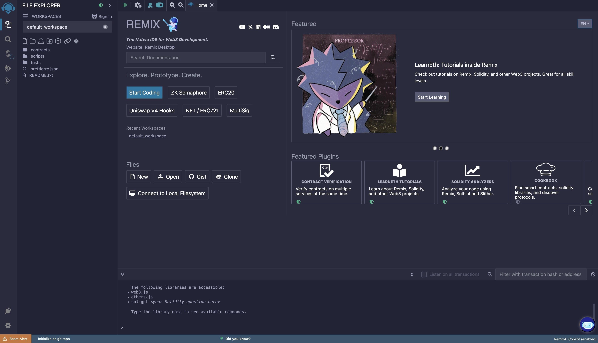

[](https://remix-ide.readthedocs.io/en/latest/index.html)
[](https://github.com/ethereum/remix-ide/blob/master/README.md#contributing)

# Remix

This repository contain only Remix's official [Read the Docs](https://readthedocs.org/) documentation source code. The documentation can be found on the [Remix IDE documentation site](https://remix-ide.readthedocs.io/en/latest/).

## Remix Project Codebases

Remix Docs (this repo)

- GitHub repo: https://github.com/ethereum/remix-ide/
- Website URL: https://remix-ide.readthedocs.io/en/latest/

Remix IDE

- GitHub repo: https://github.com/ethereum/remix-project
- Website URL: https://remix.ethereum.org

Remix About page

- GitHub repo: https://github.com/ethereum/remix-website/
- Website URL: https://remix-project.org

## About Remix Project

The **Remix Project** is a platform for development tools that use a plugin architecture. It encompasses sub-projects including Remix Plugin Engine, Remix Libraries, and of course Remix IDE.

The **Remix IDE** is an open source web and desktop application. It fosters a fast development cycle and has a rich set of plugins with intuitive GUIs. Remix is used for the entire journey of contract development with Solidity language as well as a playground for learning and teaching Ethereum.

You can start developing with Remix on the browser by visiting: https://remix.ethereum.org. If you prefer a desktop version, check out: https://github.com/remix-project-org/remix-desktop.



The built-in plugins in Remix IDE are built on top of **Remix libraries**, which handle core operations like compiling and interacting with smart contracts.. Explore the [Remix libraries README](https://github.com/ethereum/remix-project/blob/master/libs/README.md) to learn more.

## Setup the Documentation Locally

To run this documentation locally, clone this repository by running the command below:

```shell
git clone https://github.com/ethereum/remix-ide
```

In your cloned directory, `cd` into the `docs` folder and run the command below:

```shell
make run
```

## Contributing

We wholeheartedly welcome everyone to contribute. Suggestions, issues, queries and feedback are our pleasure. Please join our [Discord](https://discord.gg/ZFHV7s44Ef) server.

### Translating

The site is internationalized. **Do not make any corrections to .po or .pot files.** These get handled in our translation management platform Crowdin. To help with the translation of our documentation, please visit https://crowdin.com/project/remix-translation. To help with our translations of Remix's UI, please visit https://crowdin.com/project/remix-ui.

## Custom theming

The documentation is built using Sphinx and the Read the Docs theme as a base. The theme has been customized using CSS overrides and JavaScript to built on top of the base theme.

**conf.py**

```py
html_js_files = [
    "js/constants.js",
    "js/utils.js",
    "js/loaders.js",
    "js/initialize.js"
]

html_css_files = ["css/fonts.css", "css/tokens.css", "css/custom.css"]
```

These `js` and `css` files are been declared to run once the initial theming has been applied.

| File (`docs/_static/`) | Description                                                                                                                                                                 |
| ---------------------- | --------------------------------------------------------------------------------------------------------------------------------------------------------------------------- |
| **constants.js**       | Contains all JavaScript constants to be used throughout the other scripts.                                                                                                  |
| **utils.js**           | Contains all utility/helper functions to be used throughout the other scripts.                                                                                              |
| **loaders.js**         | Contains primary logic for all the loading scripts, organized by `initialize.js`.                                                                                           |
| **initialize.js**      | Contains high-level script logic. Declares order of `loader.js` functions to be run during `onDOMContentLoaded` (immediately after the initial DOM content has been loaded) |
| **css/fonts.css**      | Contains all font imports and declarations.                                                                                                                                 |
| **css/tokens.css**     | Contains all CSS theming variables and tokens used throughout the other CSS files.                                                                                          |
| **css/custom.css**     | Contains all custom CSS overrides and theming. This uses existing CSS selectors from the Sphinx theming to select and override various styling.                             |
