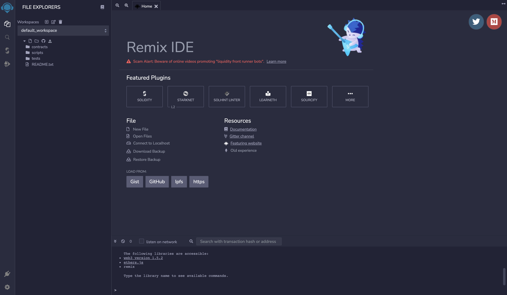

[](https://remix-ide.readthedocs.io/en/latest/index.html)
[](https://github.com/ethereum/remix-ide)

# Remix

This repository contain only Remix's official [Read the Docs](https://readthedocs.org/) documentation source code. Documentation is available [here](https://remix-ide.readthedocs.io/en/latest/).

## Remix Project Codebases

Remix Docs (this repo)
- GitHub repo: https://github.com/ethereum/remix-ide/
- Website URL: https://remix-ide.readthedocs.io/en/latest/

Remix IDE
- GitHub repo: https://github.com/ethereum/remix-project
- Website URL: https://remix.ethereum.org

Remix About page
- GitHub repo: https://github.com/ethereum/remix-website/
- Website URL: https://remix-project.org

## About Remix Project

Remix Project is a platform for development tools that use a plugin architecture. It encompasses sub-projects including Remix Plugin Engine, Remix Libraries, and of course Remix IDE.

Remix IDE is an open source web and desktop application. It fosters a fast development cycle and has a rich set of plugins with intuitive GUIs. Remix is used for the entire journey of contract development with Solidity language as well as a playground for learning and teaching Ethereum.

Start developing using Remix on browser, visit: https://remix.ethereum.org

For desktop version, see releases: https://github.com/ethereum/remix-desktop/releases

Remix libraries work as a core of native plugins of Remix IDE. Read more about libraries [here](https://github.com/ethereum/remix-project/blob/master/libs/README.md)



## Build

Steps to build this project are as follows:

First, you need to set up a Python virtual environment. This is a self-contained environment where you can install Python packages without interfering with your system's Python installation. Here's how you can create and activate a Python virtual environment:

```sh
# Create a virtual environment
# By placing in `.vscode` these will be git ignored, and not committed
python3 -m venv .vscode/venv

# Activate the virtual environment
# On Windows:
.vscode\venv\Scripts\activate

# On Unix or MacOS:
source venv/bin/activate
```

Once the virtual environment is activated, you can install the necessary Python packages:

```sh
pip3 install sphinx sphinx_rtd_theme
pip3 install myst-parser
```

Then, you can clone the repository and build the project:

```sh
git clone https://github.com/ethereum/remix-ide.git
cd remix-ide/docs/ # into /docs subfolder
make html
```

Go to `docs/_build/html` and start a Python HTTP server to serve the HTML files:

```sh
cd _build/html
python3 -m http.server
```

View by visiting `http://localhost:8000` in your web browser.

When you're done, you can deactivate the virtual environment:

```sh
deactivate
```

## Contributing

We wholeheartedly welcome everyone to contribute. Suggestions, issues, queries and feedback are our pleasure. Please join our [Discord](https://discord.gg/ZFHV7s44Ef) server.

### Translating
The site is internationalized. **Do not make any corrections to .po or .pot files.**  These get handled in our translation management platform Crowdin.  To help with the translation of our documentation, please visit https://crowdin.com/project/remix-translation. To help with our translations of Remix's UI, please visit https://crowdin.com/project/remix-ui.

## Custom theming

The documentation is built using Sphinx and the Read the Docs theme as a base. The theme has been customized using CSS overrides and JavaScript to built on top of the base theme.

**conf.py**

```py
html_js_files = [
    "js/constants.js",
    "js/utils.js",
    "js/loaders.js",
    "js/initialize.js"
]

html_css_files = ["css/fonts.css", "css/tokens.css", "css/custom.css"]
```

These `js` and `css` files are been declared to run once the initial theming has been applied.

| File (`docs/_static/`) | Description                                                                                          |
| ---------------------- |----------------------------------------------------------------------------------------------------- |
| **constants.js**       | Contains all JavaScript constants to be used throughout the other scripts.                           |
| **utils.js**           | Contains all utility/helper functions to be used throughout the other scripts.                       |
| **loaders.js**         | Contains primary logic for all the loading scripts, organized by `initialize.js`.                    |
| **initialize.js**      | Contains high-level script logic. Declares order of `loader.js` functions to be run during `onDOMContentLoaded` (immediately after the initial DOM content has been loaded) |
| **css/fonts.css**      | Contains all font imports and declarations.                                                          |
| **css/tokens.css**     | Contains all CSS theming variables and tokens used throughout the other CSS files.                   |
| **css/custom.css**     | Contains all custom CSS overrides and theming. This uses existing CSS selectors from the Sphinx theming to select and override various styling. |
