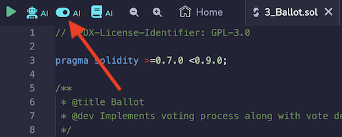
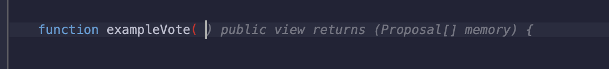
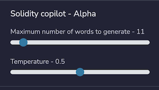

AI Tools
========

Remix has its own AI tool named **RemixAI** and a sub-project called **RemixAI Copilot** for code completion.  

RemixAI is also used in the: 
- **Explain this contract** icon at the top of the Editor
- **Explain this error** button when an error is thrown in the Solidity Compiler
- **Right-click menu options** of the Editor
- **Triple slash** (///) for prepending an AI code request in a file in the Editor

## Code Completion
When you type a space or a new line, the RemixAI Copilot will propose some code.  The proposed code is a technique called, **code completion**. The RemixAI Copilot's suggested code will take into account what has already been written in the file.  

The switch to activate it is at the top of the Editor.



All other RemixAI tools are always on.

## Editor: Right-click Menu 


For both **Explain this function** or **Explain this code**, the answer will be printed out in Remix's Terminal.

### Explain a Function and Generate Documentation
In the Right-click menu, select the options **Explain the function** and **Generate documentation**.

### Explain this code
The "Explain this code" option in the Editor's Right-click menu can be triggered with, or without, highlighting a block of code. If some code has not been highlighted, RemixAI will take into account the code surrounding the cursor.

## Editor: Code Completion
As explained above, with the RemixAI Copilot switched on, when you put a space after a word or make a new line, the Copilot will make a suggestion. 



Hit tab to accept the suggestion.


## Editor: Ask RemixAI with ///
In the Editor, when the Solidity Copilot is on, you can ask it a coding question with the `///` prompt.
For example:

```
/// write a function that returns an array with 3 elements from the function's parameters
```

## Terminal Queries using RemixAI
Before your question, either type `gpt` or `sol-gpt`.  

For example:

`sol-gpt What is the goal of modifiers?`

## Compilers: Explain Error
In the compiler error "cards" of both the Solidity compiler and the Vyper compiler there is a button to "Ask RemixAI".


## Solidity Copilot Settings



The settings for Solidity Copilot are in Remix's Settings panel. These settings are primarily for the code completion functions.

There are two settings for Solidity Copilot:

### Maximum words 
Max words sets the maximum number of words that will be returned. The fewer the words, the more likely that a context-accurate answer will be returned and the quicker the response time.

### Temperature
Temperature is an advanced setting. As the setting is increased, the range of possible answers will increase. A higher number is more likely to return a relevant answer.
