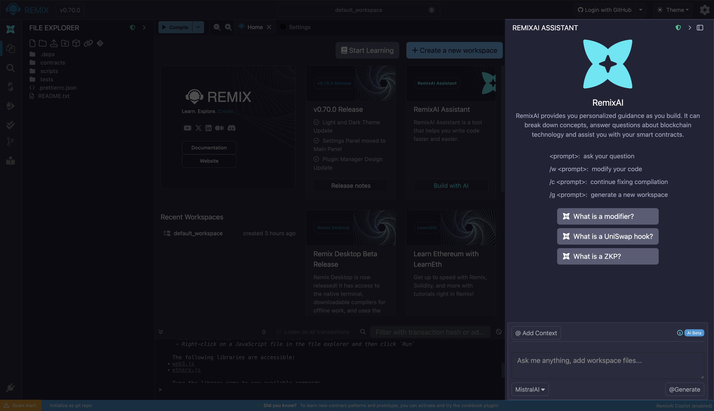
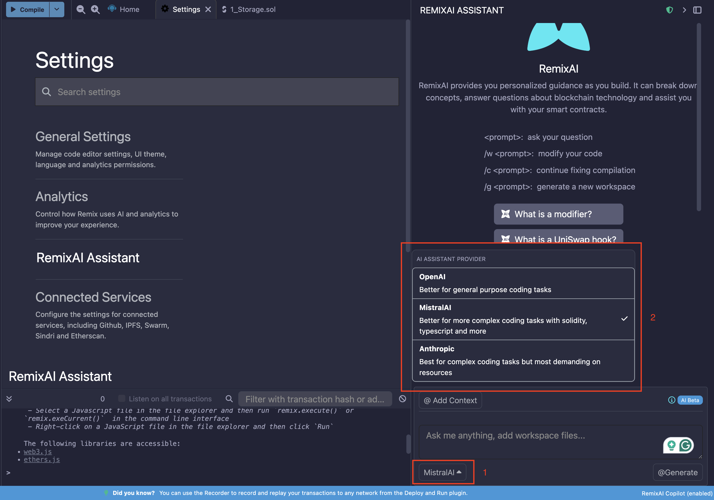
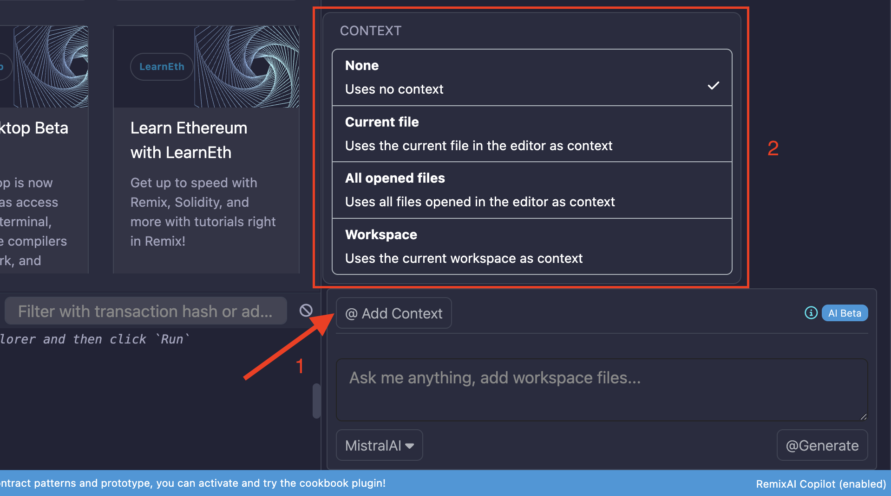
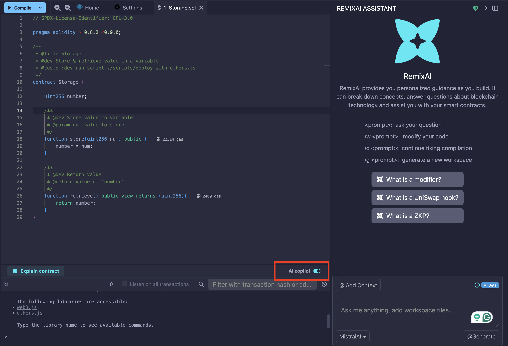
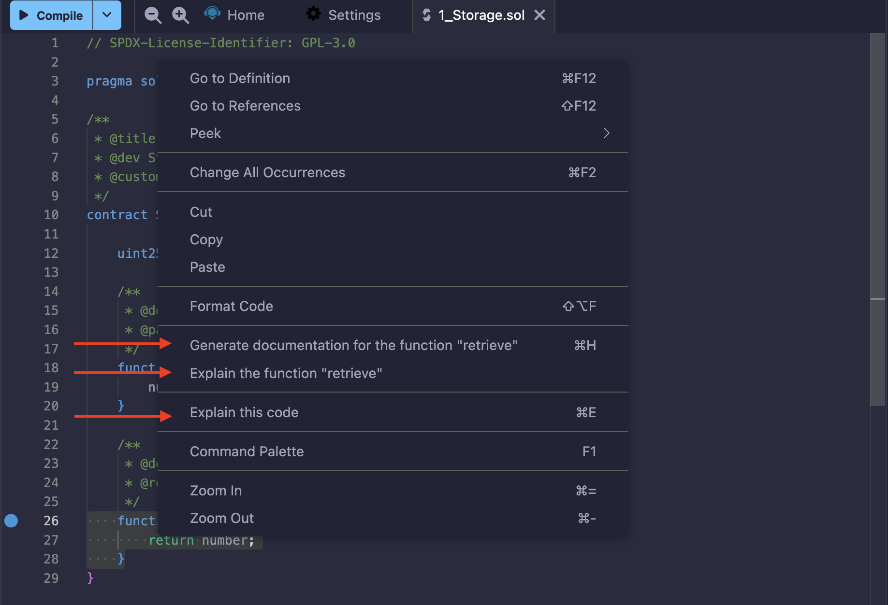
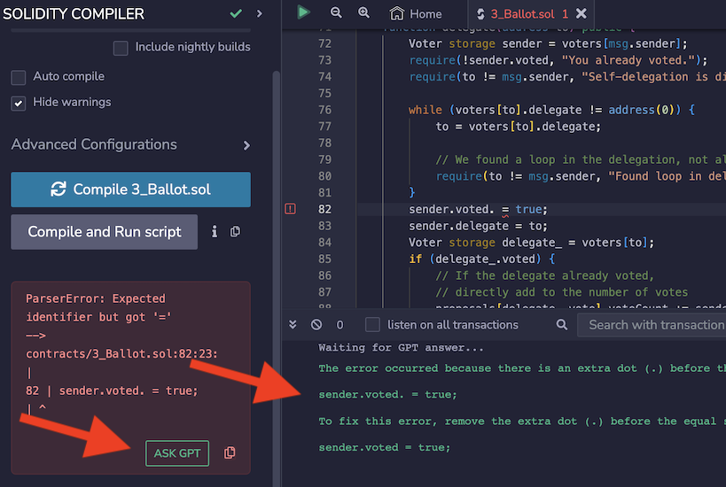

# AI Tools

Remix has its own AI tool named **RemixAI** and a sub-project called **RemixAI Copilot** for code completion. When you load Remix, the RemixAI Assistant appears in the Right Side Panel.



RemixAI is also used in the:

- **Explain contract** icon at the button of the Main Panel when a .sol file is active.
- **Explain this error** button when an error is thrown in the Solidity Compiler
- **Right-click menu options** of the Editor
- **Triple slash** (///) for prepending an AI code request in a file in the Editor

## Choosing an LLM for Code explanations

In the RemixAI Assistant, you can choose which LLM to use for Code Explanations. The default LLM is MistralAI. But just click the MistralAI button and a modal will popup where you can select Anthropic, OpenAI, or MistralAI.



## Adding Context to the LLM

Clicking the `@Add context` button will bring up a modal where you can set the context of your request.



You can also set the context to the current Workspace while you type, by starting a request with `/w`.

## Code Completion

When you type a space or a new line, the RemixAI Assistant will propose some code. The proposed code is a technique called, **code completion**. The RemixAI Assistant's suggested code will take into account what has already been written in the file.

The switch to activate it is at the bottom left of the Main Panel when a file is active. Once activated, suggests code using MistralAI LLM.



All other RemixAI tools are always on.

When you load Remix, the RemixAI Assistant appears in the Right Side Panel.

## Editor: Right-click Menu

When you right-click a function, a popup menu appears with some options executed by the RemixAI. They include, **Explain this function**, **Explain this code**, and **Generate documentation**.



```{note}
For both **Explain this function** or **Explain this code**, the answer will be printed out in Remix's Terminal.
```

The "Explain this code" option in the Editor's Right-click menu can be triggered with, or without, highlighting a block of code. If some code has not been highlighted, RemixAI will take into account the code surrounding the cursor.

## Editor: Code Completion

As explained above, with the RemixAI Copilot switched on, when you put a space after a word or make a new line, the Copilot will make a suggestion.


Hit tab to accept the suggestion.


## Editor: Ask RemixAI with ///

In the Editor, when the Solidity Copilot is on, you can ask it a coding question with the `///` prompt.
For example:

```text
/// write a function that returns an array with 3 elements from the function's parameters
```

## Terminal Queries using RemixAI

Before your question, either type `gpt` or `sol-gpt`.

For example:

```text
sol-gpt What is the goal of modifiers?
```

## Compilers: Explain Error

In the compiler error "cards" of both the Solidity Compiler and the Vyper compiler there is a button to "Ask RemixAI".


