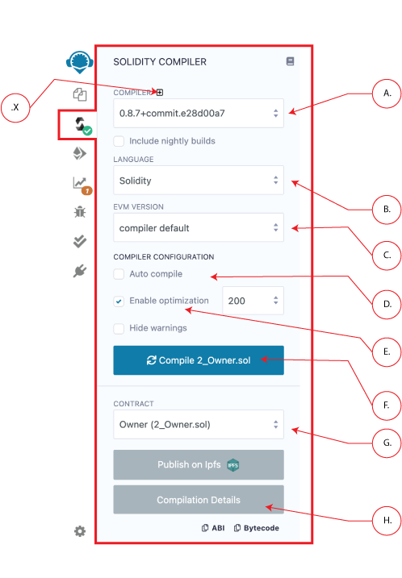

Compiler (Solidity)
===================

Clicking the Solidity icon in the icon panel brings you to the Solidity Compiler.

Compiling is triggered when you click the compile button ( **F. in image below**). If you want the file to be compiled each time the file is saved or when another file is selected - check the auto compile checkbox ( **D. in image below**).

### Solidity versions & Remix functionality
Since the Solidity version `0.5.7`, it is possible to compile `Yul` files. Please read the ([solidity documentation about Yul](https://solidity.readthedocs.io/en/latest/yul.html)) which contain some code examples.
You can use the language dropdown ( **B. in image below**) to switch the language. **This dropdown list is only available for versions greater than or equal to `0.5.7`.**

You can compile (and deploy) contracts with versions of Solidity **older than 0.4.12**.
However, the older compilers use a legacy AST — which we no longer support. Consequently, some plugins may not work and some functionality - like source highlighting in the Editor may only be partially working.

### Select an Ethereum fork
The "fork selection" dropdown list ( **C. in image below**) allows to compile code against a specific **ethereum hard fork**. 
The `compiler default` corresponds to the default hard fork used by a specific version. 

To see the name of the hard fork used in the current compilation, click the "Compilation Details" button( **H. in image below**) and in the `Metadata` section will be a sub-section called **settings**.  Open up the **settings** to see the hard fork's name.

### Auto Compile
If a contract has a lot of dependencies it can take a while to compile - so you use autocompilation at your discretion.

### Enable optimization
According to the the Solidity Docs, "the optimizer tries to simplify complicated expressions, which reduces both code size and execution cost, i.e., it can reduce gas needed for contract deployment as well as for external calls made to the contract."

For recent versions of Solidity, it is [recommended to enable optimization](https://blog.soliditylang.org/2020/11/04/solidity-ama-1-recap/#why-do-you-think-people-are-generally-suspicious-of-the-optimizer-and-are-they-right-to-be) . 

To learn more about optimization, ( **F. in the image**) visit the [Solidity docs on the optimizer](https://docs.soliditylang.org/en/latest/internals/optimizer.html).

To the right of the **Enable optimization** checkbox is the box to input the number of Optimization runs.  The default value is 200.  

You may ask — "What is the right number of runs for my contract?" And the Solidity docs say:

   > If you want the initial contract deployment to be cheaper and the later function executions to be more expensive, set it to --optimize-runs=1. If you expect many transactions and do not care for higher deployment cost and output size, set --optimize-runs to a high number.

To learn more about the optimization runs, visit the [Solidity docs about Optimizer options](https://docs.soliditylang.org/en/latest/using-the-compiler.html?highlight=optimize-runs#optimizer-options).

### Compilation Details and Publishing

Because a solidity file can include multiple contracts and because contracts can import other contracts,  **multiple contracts are often compiled**.  **However**, only 1 contract's compilation details can be retrieved at a time. 

To select the desired contract, use the **Contract select box** ( **G. in the image**).  

Using the publish button, you can upload your contract to Swarm (only non
abstract contracts can be published) & IPFS. 

When publishing contracts that import other contract,  the main contract and all of its imported contracts  will be published - each to their own address.

**Published data contains the `abi` and the solidity source code.**

After a contract is published, **a modal will pop up**.  This modal contains the contract's address as well as the addreses of the contracts that it imported and the address of the contract's **metadata**.

When the "Compilation Details" button is clicked ( **H. in image**), a modal opens displaying detailed information about the current selected contract.

### Compilation Errors and Warning
Compilation Errors and Warning are displayed below the contract section.
At each compilation, the static analysis tab builds a report. 

It is important to address reported issues even if the compiler doesn't complain. ([see more](static_analysis.html))

### Custom Solidity Compilers
For those writing your own custom solidity compiler, you can import that by clicking the **+** button (**X. in the image**) to open a modal where you can input the url of the compiler to be loaded.
