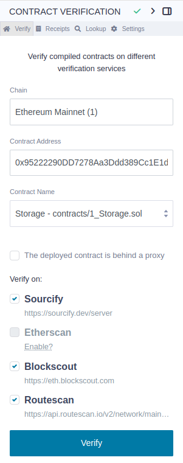
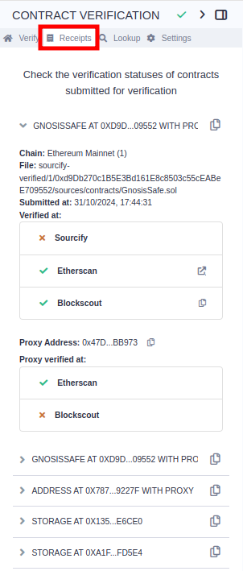
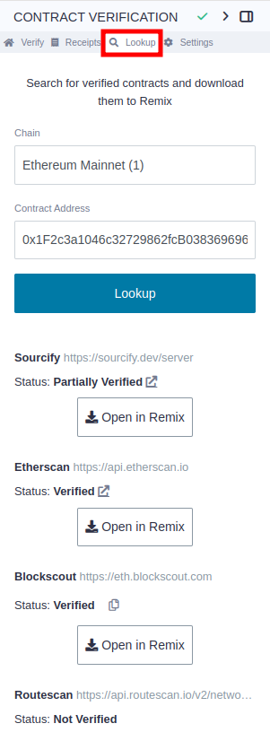
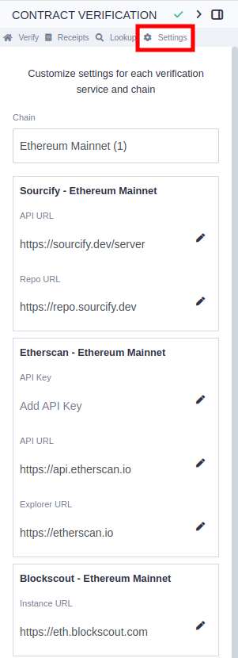
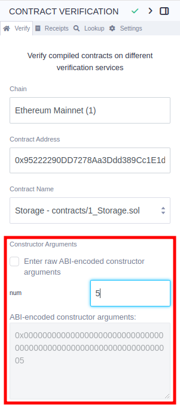

# Contract Verification

Remix has a plugin for contract verification. With this plugin, you can verify your contracts on Sourcify, Etherscan, Blockscout and Routescan.

The plugin is called: **CONTRACT VERIFICATION**.

You can access it from the Plugin Manager.

The plugin has 4 pages, the **Verify** page, the **Receipts** page, the **Lookup** page, and the **Settings** page.

## Verify page

This is the home view of the plugin where you can verify your contracts.



You can select which verification services you want to use. By default, all that have a valid configuration are selected. On Ethereum Mainnet, this will be all but Etherscan. In order to enable Etherscan, you need to input an API key in the Settings page.

### The prerequisites for verification are:

1. The address of a deployed contract on a public network
2. That same contract compiled in Remix
3. Constructor parameters same as used during deployment (if required)

## Receipts page

Verification receipts are found on the receipts page.



You can hover over the status symbols to get more information about failed verifications.

## Lookup page

The Lookup page is used to check if a contract is verified on the verification services, and to download its source code into the file editor.



## Settings page

In the settings page, you can configure custom API URLs for the verification services, and add your own API keys. For Etherscan, adding an API key is mandatory.



The settings are always stored per chain, meaning that if you change the settings for a chain, it will not affect other chains. However, the Contract Verification plugin uses the Etherscan v2 API, meaning the same API key will work for over 50 different chains.

```{important}
For the time being, you’ll still need to input your Etherscan v2 API key on each different chain, but at least it will be the same key for all of them.
```

## Verifying with constructor arguments

When a contract has arguments in the constructor, a text box will show for inputting the same constructor inputs as the deployed contract.



## Verifying a proxy contract

If your contract is behind a proxy, you can verify also the proxy with the implementation contract. You just need to check the "The deployed contract is behind a proxy" checkbox, and provide the address of the proxy contract.


The plugin will first verify the implementation contract, and then verify the proxy contract.

Proxies can only be verified on Etherscan and Blockscout.
