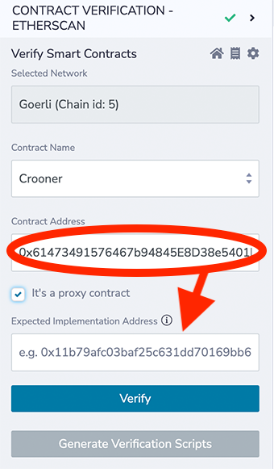

Verifying a contract
====================

There are two contract verification services in Remix, Sourcify and Etherscan and the extended Etherscan family of block explorers - like PolygonScan or Optimism Scan.

Sourcify
--------

Documentation about Sourcify is found [here](https://github.com/ethereum/sourcify#readme).

Etherscan
---------

The Etherscan plugin is called: **Contract Verification Etherscan**.

You can access it from the Plugin Manager.

The plugin has 3 pages, the verification page, the receipts page, and the settings page.

When you go to the plugin for the first time, you'll need to input the Etherscan API key.

### Etherscan API Key
Etherscan is a block explorer for Ethereum mainnet and they make block explorers for other chains. 

For Ethereum testnets like Goerli or Sepolia, you can use the same API key. 

If you are trying to verify on L2 chains like Optimism, you'll need a different API key for their Optimism block explorer. Not all of the block explorers made by Etherscan have API keys. The Remix Contract Verification - Etherscan plugin only works where you can login to that block explorer to get the API key.

Once the API key is input, the plugins homepage is opened for verification.

### Verification page
Once the API key is input, the plugins homepage is opened for verification.  

The network is NOT selected Etherscan plugin. The network is chosen in Deploy & Run and in your browser's wallet (if using). 

The prerequisites for verification are:
1. The address of a deployed contract on a public network
2. That same contract compiled in Remix

### Receipts
Verification receipts are found on the receipts page.

### Verifying a proxy contract
Before verifying a proxy contract, the associated implementation contract must already be verified. 

**Do not check the proxy box when verifying the implementation.**
Then after verifying the implementation contract:
1. Cut out the implementation contract's address from the Contract Address box.
2. Click the "It's a proxy contract" checkbox.
3. Paste the verified implementation contract's address in the Expected Implementation Address box.
4. Paste in the proxy contract address into the Contract Address box.

### Generate Verfication Scripts
Clicking the Generate Verification Scripts on the Verification page, will create a folder named etherscan in the Workspace's scripts folder that contains .ts files for verifying and returning the receipt status.

