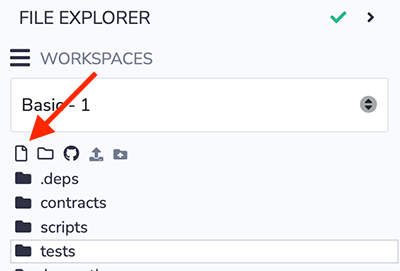
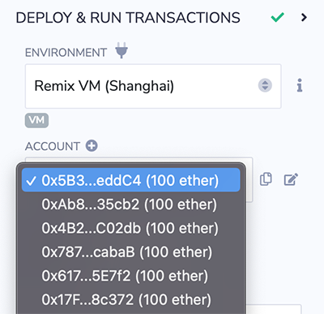
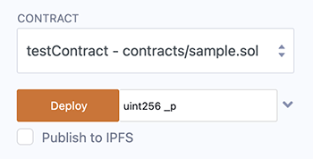
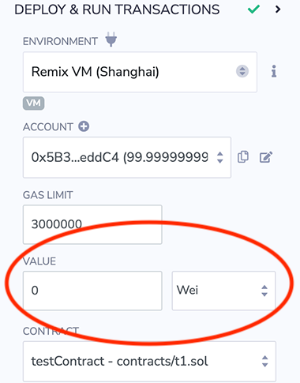
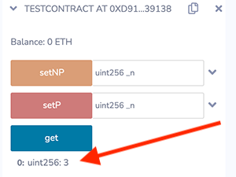

# Creating and Deploying a Contract

Let's go through a basic workflow:

- create a new file
- code a contract in the file
- compile the contract
- deploy it to the local simulated blockchain (Remix VM)
- interact with the deployed contract's functions

## Creating a new file



In the File Explorer, create a new file by clicking on the new file icon, and name it. The `.sol` is default extension in Remix, if a file is named without an extension, `.sol` will appended.

**NOTE:** For information about templates or workspaces, see the {doc}`File Explorer docs </file_explorer>`.

In the editor, paste in the following contract into the empty file:

```Solidity
// SPDX-License-Identifier: GPL-3.0

pragma solidity ^0.8.18;

contract testContract {

    uint256 value;

    constructor (uint256 _p) {
        value = _p;
    }

    function setP(uint256 _n) payable public {
        value = _n;
    }

    function setNP(uint256 _n) public {
        value = _n;
    }

    function get () view public returns (uint256) {
        return value;
    }
}

```

When pasting in code, make sure you understand it before deploying or interacting with it. Don't get scammed!

## Compile the Contract

With the contract above as the active tab in the Editor, compile the contract.  
A quick way to compile is to hit **ctrl + s**. You can also compile by going to the Solidity Compiler and clicking the compile button, or by right clicking a file in the File Explorer, or by clicking the play button at the top of the Editor.

**For More Info** see the docs on the {doc}`Solidity Compiler </compile>`.

## Deploy the contract

Go to the **Deploy & Run Transactions** plugin.


At the top of this plugin is the Environment selectbox. Here you can choose where you want to deploy your contract. There are many choices. For more info about these options see {ref}`this section <run:environment>` of the docs.

For a brief synopsis:

**Injected Provider** is used to connect Remix with a Browser Wallet (e.g. Metamask) which is generally for deploying to a public network.

**Remix VM** is a test blockchain in the browser. There are quite a few "flavors" of the Remix VM. Each "flavor" is associated with a different hard fork with the name in parathesies - e.g. Remix VM (Shanghai) or for the choice of a chain to fork into the Remix VM.

The **Remix VM** is convenient because it is a blockchain that runs in the browser and nothing else needs to be installed in order to run it.

**Dev** is for connecting Remix to a local chain running on your computer.

**L2** is for connecting Remix to Optimism or Arbitrum via a browser wallet. Its essentially the same as Injected Provider, but it sets the wallet with the configuration of the specified L2.

(For details see [Running transactions](https://remix-ide.readthedocs.io/en/latest/run.html))

## Select the top Remix VM environment

Choose the top first Remix VM in the dropdown list.

The Remix VM comes with 10 accounts funded with 100 ether.

**NOTE:** When you are in the **Remix VM** and you reload the browser - the **Remix VM** will also restart to its fresh & default state. For a more realistic testing environment, use a public testnet.



## Deploying a contract



The constructor of `testContract` needs a parameter of the type `uint256`.
Input a uint256 and click on `Deploy`.

The transaction is created which deploys the instance of `testContract` .

In a more realistic blockchain, you would have to approve the transaction and then wait for the transaction to be mined. However, because we are using the `Remix VM`, the execution is immediate.

The terminal will give information about the transaction.

The newly created instance is displayed in the **Deployed Contracts** section.


## Interacting with the deployed instance

Clicking on the caret to the left of the instance of TESTCONTRACT will expand it so its functions are visible.

This new instance contains the 3 functions (`setP`, `setPN`, `get`).

Clicking on `setP` or `setPN` will create a new transaction.

`setP` is a `payable` function (payable functions have red buttons). With a payable function, value (ETH) can be sent to the contract. The amount of ETH is chosen in the VALUE input field and the unit of ETH is selected in the box to the right.



`setPN` is not payable (an orange button - depending on the theme). It is not possible to send value (Ether) to this function.

`get` is a **view function** (a blue button - depending on the theme). It doesn't execute a transaction because a `get` does not modify the state (it is only returning the value of the variable `value`).

The value that gets returned appears just below the `get` button.


