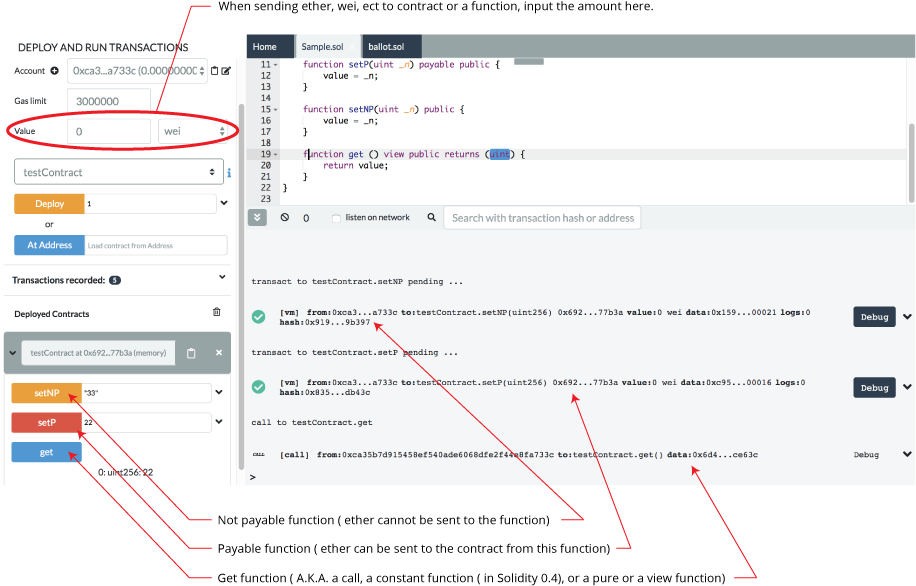

Creating and Deploying a Contract
================================

This page contains the process of creating a contract, compiling it, deploying and then interacting with it.

Sample contract
---------------
This contract is very basic. The goal is to quickly start to create and
to interact with a sample contract.


Go to the File Explorer, create a new file, name it and in the editor paste the contract below.

``` 
// SPDX-License-Identifier: GPL-3.0

pragma solidity ^0.7.6;

contract testContract {

    uint256 value;

    constructor (uint256 _p) {
        value = _p;
    }

    function setP(uint256 _n) payable public {
        value = _n;
    }

    function setNP(uint256 _n) public {
        value = _n;
    }

    function get () view public returns (uint256) {
        return value;
    }
}

```

Compile the file
----------------
With the contract above as the active tab in the Editor, compile the contract.  

**For More Info** see the docs on the ([Solidity Compiler](compile.html)).

Deploy the file
----------------
Go to the **Deploy & Run** plugin.

There are 3 type of environments Remix can be plugged to:
* Javascript VM
* Injected Web3
* Web3 Provider

 (For details see [Running transactions](https://remix-ide.readthedocs.io/en/latest/run.html))

Both **Injected Web3** and **Web3 Provider** require the use of an external tool.

The external tool for `Injected provider` is Metamask and for `Web3 provider` is an Ethereum node itself.

The **JavaScript VM** is convenient because it is a blockchain that runs in
your browser and you don't need any other software or Ethereum node to run it. 

**NOTE:** When you are in the **Javascript VM** and you reload the browser - the **Javascript VM** will restart in an empty state.

For performance purposes ( which is to say - for testing in an environment that is closest to the mainnet), it can be better to use an external node.

Select the VM mode
---------------------

Make sure the VM mode is selected. All accounts displayed in `Accounts` should have 100 ether.


Deploying an instance
---------------------


The constructor of `testContract` needs a parameter (of type `uint256`).
Input a uint256 and click on `Deploy`.

The transaction is created which deploys the instance of `testContract` .

In a "normal" blockchain, you would have to wait for the transaction to be mined. However, because we are using the `JavaScript VM`, our execution is immediate.

The terminal will give information about the transaction.

The newly created instance is displayed in the **Deployed Contracts** section.


Interacting with an instance
----------------------------
Clicking on the caret to the left of the instance of TESTCONTRACT will open it up so you can see its function.

This new instance contains 3 actions which corresponds to the 3
functions (`setP`, `setPN`, `get`). Clicking on `setP` or `setPN` will
create a new transaction.

Note that `setP` is `payable` (red button) : it is possible to send
value (Ether) to the contract.

`setPN` is not payable (orange button - depending on the theme) : it is not possible to send value (Ether) to the contract.

Clicking on `get` will not execute a transaction (usually its a blue button - depending on the theme). It doesn't execute a transaction because a `get` does not modify the state (the variable `value`) of this instance.

Because `get` is a **view function**, you can see the return value just below the
`get` button.


