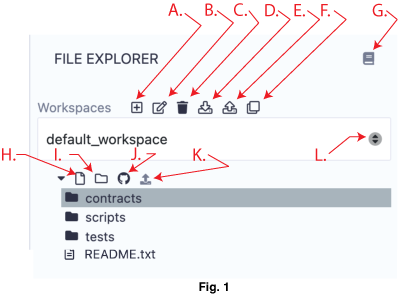
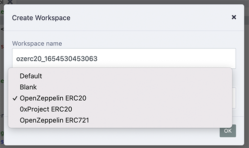

File Explorer
=============

To get to the File Explorer module - click the File Explorer icon.

The File Explorer is for managing Workspaces and files.  There is also a context menu that pops up when you right click on a file or folder.

File Storage
------------
By default, Remix IDE stores files in **IndexedDB**.  

Coding in Remix IDE Online is different from writing in a Google doc. Yes, both are written in a browser but a Google doc saves your work to Google’s servers, and Remix—out of the box—only saves your code to your browser’s storage. So tread carefully, browser storage is not permanent!

**Important Note:** Clearing the browser storage & IndexedDB will **permanently delete** all the files stored there. 

## File Storage outside of the browser and Version Control

If you want to use browser storage, but also to save a git repo on IPFS, use the **DGIT** plugin.  

If you want to store files on your computer's filesystem, use **[Remixd](remixd.html)** or use the **[desktop version of Remix IDE](https://github.com/ethereum/remix-desktop/releases/)**. Remixd enables you to have access to a selected folder on your hard drive. Remix Desktop is a version of Remix IDE in an Electron app. 

Also see this article about [securing your files in Remix](https://medium.com/remix-ide/securing-you-file-in-remix-how-to-clone-and-push-f1350111aa13?source=friends_link&sk=a3dbd0d3b0b44a29a28e8c10f8821fde)

File Explorer Tour
-------------------

The book icon - **F.** is the link to the documentation (this page).

### Workspaces
Workspaces help to organize your files by allowing you to separate your projects.
Here are the basic operations of managing a Workspace. The letters in bold below refer to the labels in fig. 1.

- **A.** Add a Workspace  
- **B.** Rename a Workspace   
- **C.** Delete a Workspace   
-  **D.** Download all Workspaces This will create a .zip file with all the files of all the Workspaces.  The zip file will have a folder called **.workspaces** that will contain a folder of each workspace.  Depending on your OS, you may need to change the preferences on .workspaces folder to make it visible.   
- **E.** Upload the Workspaces backup made from the previous icon.  
- **K.** Choose a Workspace 
### File Manipulation
The letters in bold below refer to the labels in fig. 1.

- **G.** Create a file   
- **H.** Create a folder   
- **I.** Publish the Workspace to a GIST  
- **J.** Load a local file into the current Workspace 

## Workspaces with Templates
When you create a new Workspace, a modal comes up where you choose which template of files to include.

## Creating new files

There are 2 ways of creating files.  The first is to click on the new file icon (**G.** in fig.1), an input for a new the file’s name will appear in the **File Explorer**. Once a name is entered, the new empty file will open in the Editor.

The second way of creating a file is to right click on a file or folder to get a popup menu.

The new file will be placed in **the currently selected folder** of the Workspace. If a file and not a folder is selected, then the new file will be placed in that file’s folder. And if nothing is selected, then the file will be placed in the root of the current workspace's folder. Or to be brief — just be mindful of what folder it lands in.

Publish to Gist
---------------

The icon (marked **I.** in fig.1) publishes all files from the current Workspace to a gist. **The Gist API requires users to be authenticated** to be able to publish a gist.  

Click [this link](https://github.com/settings/tokens) to Github tokens setup and select Generate new token. Then check the **Create gists** checkbox and generate a new token. Also make sure you check the box to enable the creation of Gists with this token.

Take the token and paste it in Remix's **Settings** module in the **Github Access Token** section. And then click Save.

You can also publish by right clicking on the file or folder.

Right-Click on a File or Folder
-------------------------------

Right-clicking on a file or folder will bring a context menu — where you can create a folder or file within the same folder or to delete, rename, or publish the file or folder. 

The functionality of the context menu also works with RemixD (which gives you have access to a folder on your hard drive).  

**Note:** When working with RemixD, and when adding files to the shared folder from your computer (and not from Remix), you'll need to open and close the containing folder or switch in and out of **localhost** workspace to refresh the view.

Right-Click on a Solidity file
-------------------------------
Right-clicking on a file with a .sol extension will bring up an expanded context menu - which will also let you compile & flatten a file.

Right-Click on a Script
------------------------

Right-click on any file with a .js or .ts extension to get the **Run** option in the context menu to run the script.  The **Run** in the context menu is a shortcut.  The other way to get a script to run is to:
1. Click on the script to make it the active tab in the editor 
2. Input the command `remix.exeCurrent()` in the console.
