File Explorer
=============
The File Explorer is for managing workspaces and files.  This plugin also contains many shortcuts and commands.  For a quick tour, right-click on a file to get a pop-up menu and also check the hamburger menu at the top right of the plugin.

To find the File Explorer module - click the File Explorer icon.

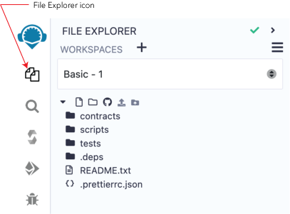

The green checkmark at the top of the page means that this plugin is maintained by Remix Team.  When the caret is clicked, more info about the plugin will be shown -including a link to this documentation.

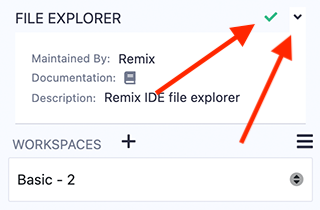

File Storage
------------
By default, Remix IDE stores files in **IndexedDB**.  

Coding in Remix IDE Online is different from writing in a Google doc. 
- A Google doc saves your work to your account on Google’s servers.
- Remix has no user accounts. By default, files are ONLY saved locally in the browser’s storage. So tread carefully, browser storage is not permanent!

It is very important to have a file backup & file saving strategy. 

**Check the following techniques for:**
- [saving to your hard drive](#file-storage-on-your-hard-drive)
- using [remote Git repos](#connecting-remix-to-remote-git-repos)
- [backing up workspaces](#backup).

**Important Note:** Clearing the browser storage & IndexedDB will **permanently delete** all the files stored there. It is prudent to backup your workspaces before deleting them...just in case. 

### File Storage on your hard drive
#### Remixd
For storing files on your computer's hard drive when using Remix Online IDE, use **[Remixd](remixd.html)** 
- Remixd is an NPM module that runs on your computer. It allows you to share a specified folder on your computer with Remix IDE. 

#### Remix Desktop
Remix Desktop is a version of Remix IDE in an Electron app. Note that when using Remix Desktop, you cannot use a browser wallet like MetaMask, because Remix Desktop does not run in a browser.  To connect to public networks, you need to use service like Infura and then use the WalletConnect plugin to approve transactions on your mobile device.

### Connecting Remix to remote Git repos
**If you are not using Remixd, it is highly recommended that you save to a remote repo.** 
(Browsers do crash causing localstorage & indexedDB to be corrupted)

Remix IDE can be connected to remote Git repos hosted in GitHub (or similar service) or in IPFS.  
Most of the Git operations are done in the **DGit** plugin. (DGit stands for Decentralized GIT).

[Branch management](#branch-management) is also available at the bottom of the File Explorer when the Workspace is Git initialized.

Also see this article about [securing your files in Remix](https://medium.com/remix-ide/securing-you-file-in-remix-how-to-clone-and-push-f1350111aa13?source=friends_link&sk=a3dbd0d3b0b44a29a28e8c10f8821fde)

Workspaces
------------

Workspaces in Remix are special folders that separate projects.  Files in one workspace cannot import or access files in different workspace.  Choosing a workspace is done with the **Workspaces** select box.

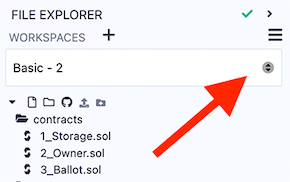

#### New Workspace
Workspaces are created by clicking the + button or by going to the hamburger menu in the upper right side of the File Explorer.

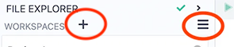

When making a new workspace, Remix offers the following templates: 

- Blank
- Remix Default
- OpenZeppelin ERC20
- OpenZeppelin ERC721
- OpenZeppelin ERC1155
- 0xProject ERC20
- Gnosis MultiSig

When choosing an OpenZeppelin template, additional functionality can be added.
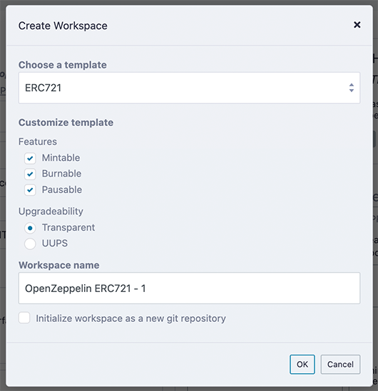

#### Workspace operations

The **Workspace hamburger menu** is for operations that work on an entire workspace.

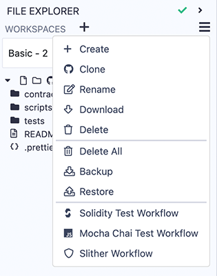

##### Clone
When clicking Clone, you’ll be asked for the url of a remote repo. A new workspace will be created that will contain the cloned repo. To manage the Git repo, go to the Dgit plugin.
##### Backup
Backup is for downloading all the Workspaces in a .zip file. The zip file will have a folder called **.workspaces** that will contain a folder of each Workspace.  Depending on your OS, you may need to change the preferences on .workspaces folder to make it visible.  

##### Restore
Restore is only for uploading the backup zip file.

##### Create GitHub Actions
The Workspace operations to create **Solidity Test Workflow**,  **Mocha Chai Test Workflow**, and **Slither Workflow** are for creating GitHub actions. When clicked, a .yml file is created in the .workflows folder of the active Workspace.

### Workspaces initialized with Git
Git initialized workspaces will have the Git icon next to them in the **Workspaces** select box.

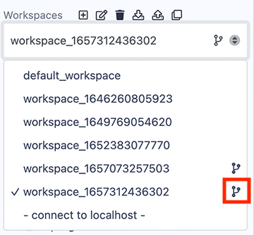

To initialize a new Workspace for GIT, check the box at the bottom of the Create Workspace modal.
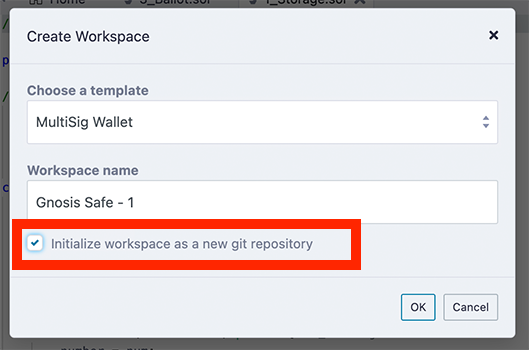

Working with Files
-------------------
When a file is clicked on it will appear in the Editor.

Under the **Workspaces** select box are a number of icons that perform operations on files.  More operations can be accessed by right-clicking on a file or folder ([see below](#right-click-on-a-file-or-folder)).

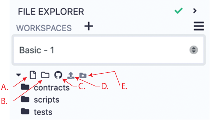

- **A.** Create a file   
- **B.** Create a folder   
- **C.** Publish all the file in this Workspace to a GIST 
- **D.** Upload a file into the current Workspace 
- **E.** Upload a folder into the current Workspace 

## Creating new files

There are 2 ways of creating files:  
- The first is to click on the new file icon (**H.** in fig.1), then an input for the new file’s name will appear in the **File Explorer**. Once a name is entered, a new empty file will open in the Editor.  If the file's name is entered **without** a file extension, the extension **.sol** will be appended by default.

- The second way of creating a file is to right-click on a file or folder to get a popup menu.

The new file will be placed in **the currently selected folder** of the Workspace. If a file and not a folder is selected, then the new file will be placed in that file’s folder. And if nothing is selected, then the file will be placed in the root of the current workspace's folder. Or to be brief — just be mindful of what folder it lands in.

Publish to Gist
---------------

The icon (marked **J.** in fig.1) publishes all files from the current Workspace to a gist. **The Gist API requires users to be authenticated** to be able to publish a gist.  

Click [this link](https://github.com/settings/tokens) to Github tokens setup and select Generate new token. Then check the **Create gists** checkbox and generate a new token. Also make sure you check the box to enable the creation of Gists with this token.

Take the token and paste it in Remix's **Settings** module in the **Github Access Token** section. And then click Save.

You can also publish by right-clicking on the file or folder.

Right-Click popup menu
-------------------------------
### Right-Click on a folder
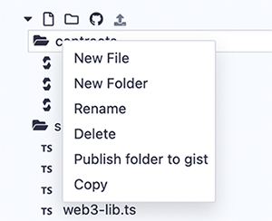

Right-clicking on a folder will bring a popup menu for operations you can do on that folder. 

The right-click popup menu also works with Remixd (which gives you access to a folder on your hard drive).  

**Note:** When working with RemixD, and when adding files to the shared folder from your computer (and not from Remix), you'll need to open and close the containing folder or switch in and out of **localhost** workspace to refresh the view.

### Right-Click on a Solidity file

Right-clicking on a file with a .sol extension will bring up a popup menu - which includes options for compiling & flattening, creating UML diagrams, and generating documentation.

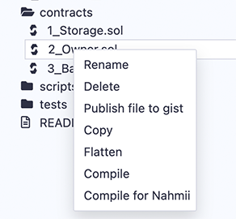

### Right-Click on a Script

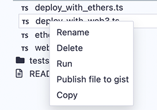

Right-click on any file with a .js or .ts extension to get the **Run** option in the popup menu to run the script.  

If the script you want to run is the active file in the Editor, you can also run it by using play button at the top left of the Editor or by inputting the command `remix.exeCurrent()` in the console.

Git in the File Explorer
------------------------
In Remix, a workspace can be initialized with Git.  The Git commands then operate on the workspace.

### Initialize
For information about initializing a workspace, see this [section](#workspaces-initialized-with-git).

### Clone
The clone command is located in the **Workspace hamburger menu**.  For more information, see the section about [workspace operations](#workspace-operations)
### Branch Management
When you are in a workspace that is initialized with Git, at the bottom of the File Explorer, you’ll see the place for managing branches.

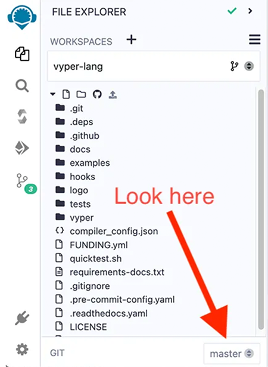

Then when you click on the branch name, this section will expand with an interface for switching branches and for creating a new branch.

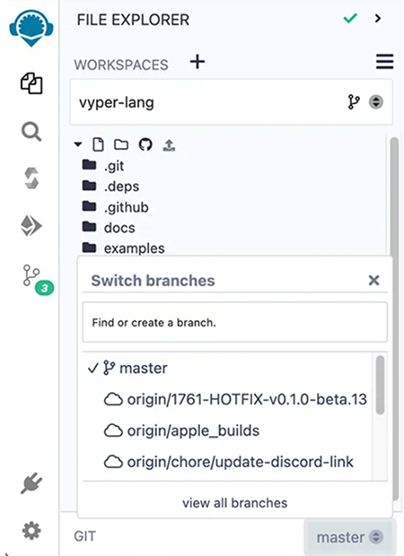

For the rest of the Git commands, go to the DGit plugin.

For more info about the DGit plugin, see . 
