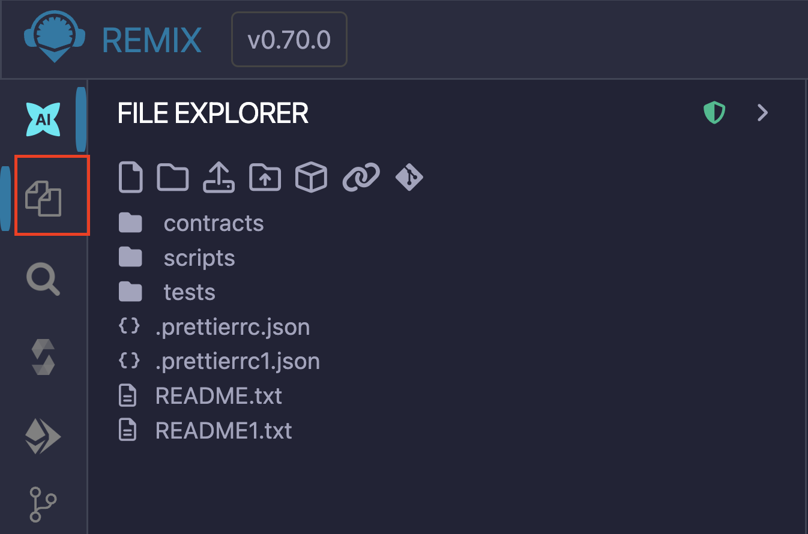
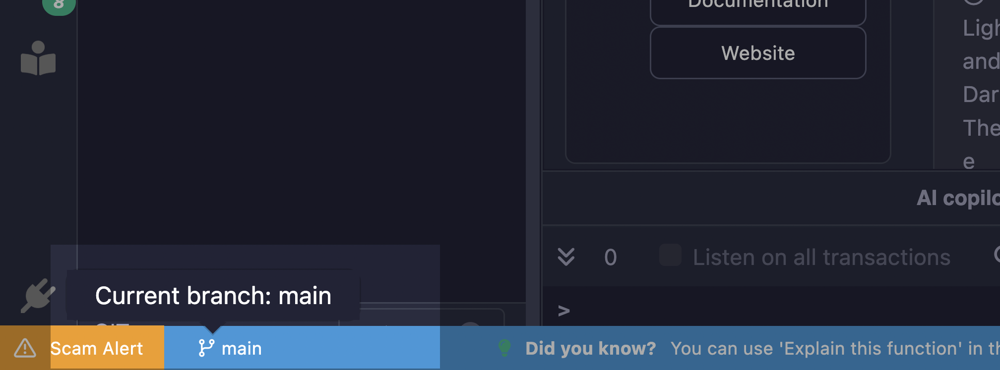
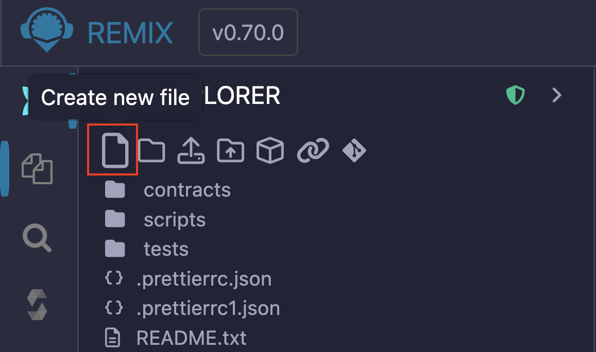
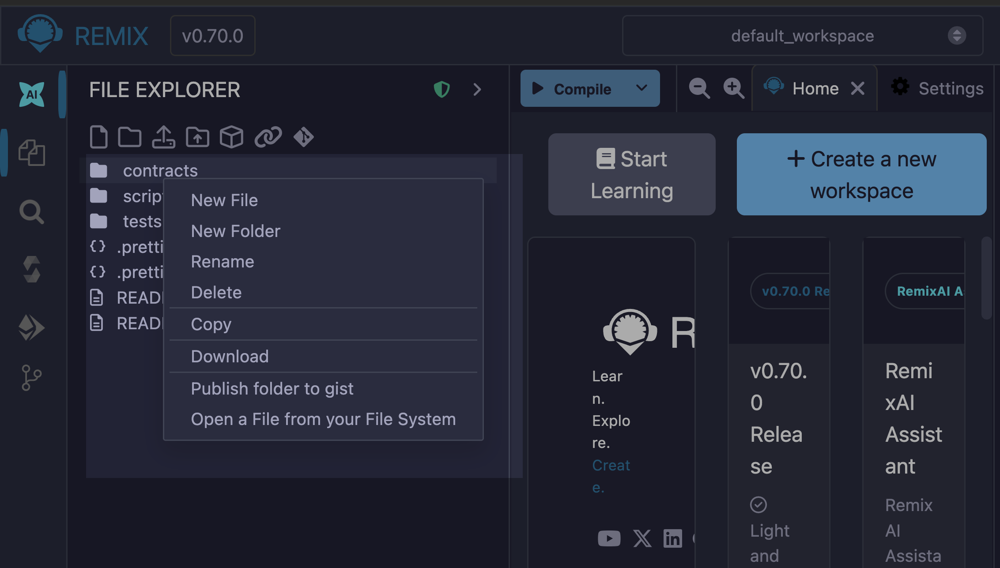
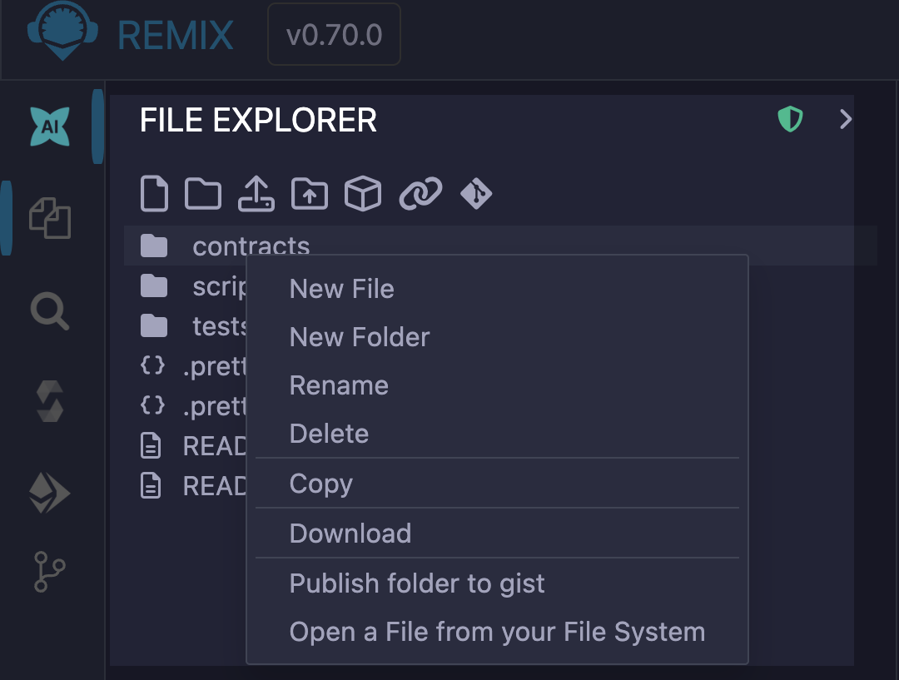
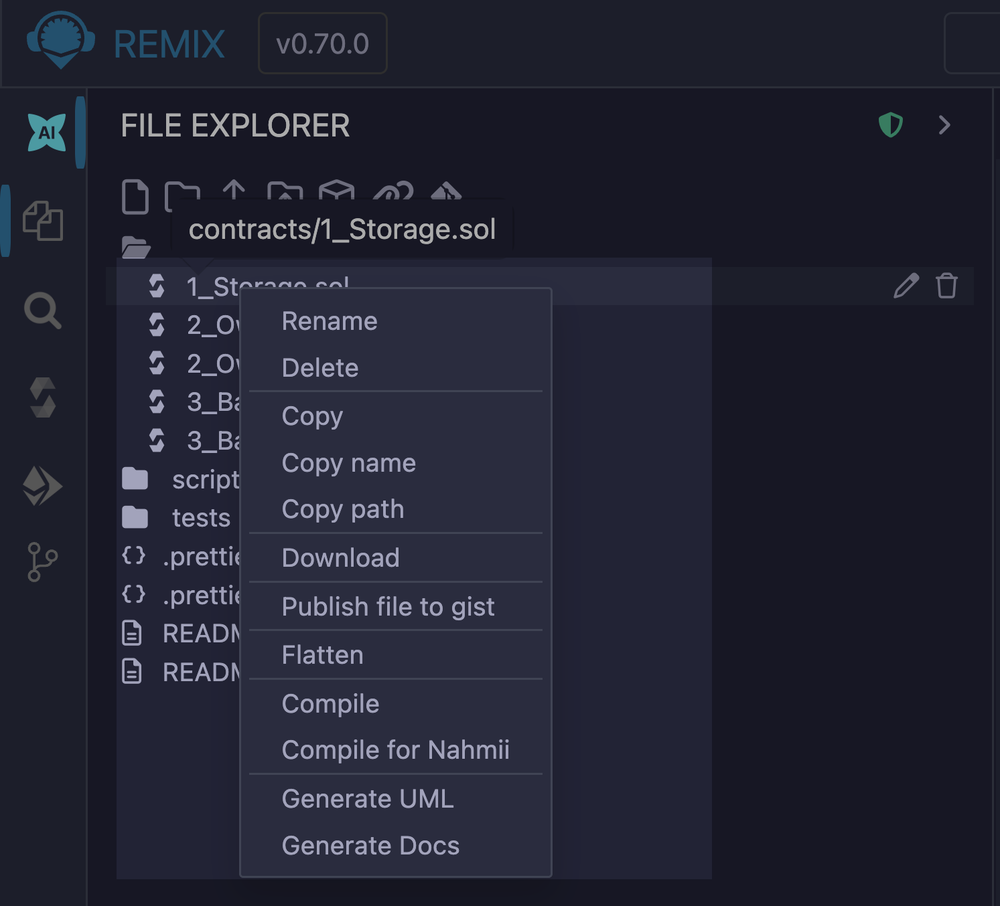
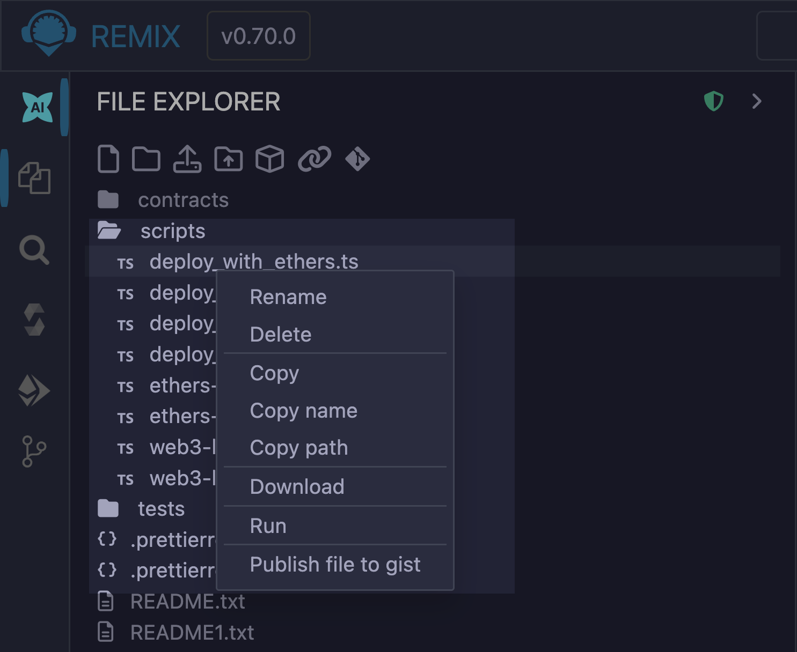

# File Explorer

The File Explorer is the plugin responsible for managing files. It includes a pop-up menu that is activated when you right-click on a file.



The green shield icon at the top of the File Explorer page on the Sidebar indicates that the plugin is maintained by Remix Team. When you click the caret next to the icon, the Sidebar will display details about the plugin, including a link to its documentation page.


## File storage

By default, Remix IDE stores files in **IndexedDB**, a database built into the browser. Your data is only stored locally in your browser and not on an external server.

Browser storage is ephemeral and browser crashes might lead to complete loss of data

Thus, it is important to have an alternative file backup/saving strategy.

**Some recommended strategies include:**

- [Saving to your hard drive](#file-storage-on-your-hard-drive)
- Using [remote Git repositories](#connecting-remix-to-remote-git-repos)
- [Backing up workspaces](#backup).

### Saving files on your hard drive

There are two ways you can save the files you create and use on Remix to your hard drive. You can use Remixd or Remix Desktop.

#### Remixd

Remixd is an NPM package that allows you to share a specified folder on your computer with Remix IDE. Thus, your files are saved on IndexedDB and on the specified folder. Learn more about Remixd on our {doc}`Remixd guide </remixd>`.

#### Remix Desktop

Remix Desktop is a version of the Remix IDE that exists as a native app on your computer instead of a browser app. Since it's a native app on your computer, the files are saved directly to your hard drive.

### Connecting Remix to remote Git repositories

Remix IDE supports version control with version control platforms like GitHub (or similar like GitLab) and in the InterPlanetary File System (IPFS), allowing you to store the code you write on remote repositories.

The version control operations are managed with Git through a plugin known as **DGit** (Decentralized Git). Additionally, you can [manage your branches](#branch-management) on the Remix IDE using the branch icon that appears at the bottom of the File Explorer after you initialize Git.



Also see this article about [securing your files in Remix](https://medium.com/remix-ide/securing-you-file-in-remix-how-to-clone-and-push-f1350111aa13?source=friends_link&sk=a3dbd0d3b0b44a29a28e8c10f8821fde).

### Publishing to a GitHub gist

In addition to these methods, you can also publish your files to a GitHub Gist. This method just takes a snapshot of your project's current state and publishes it to a GitHub gist. Any changes made after publishing it will not update the published Gist.

To use this feature, you need to add a GitHub access token with the "**Create Gist**" permission enabled to Remix because the Gist API requires users to be authenticated to be able to publish a gist.

To generate a GitHub token, visit the [GitHub Settings page](https://github.com/settings/tokens) and select "**Generate new token**". Ensure you tick the **Create gists** checkbox and generate a new token. Copy the token and paste it in Remix's **Settings** module in the **Github Access Token** section. And then click "**Save**".

After the initial setup, you can publish a gist by right-clicking on a file (publish the file), folder (publish the folder), or Side Bar (publish the entire workspace) and selecting the "**Publish folder to gist**".

## Creating new files

There are two ways you can create files on the Remix IDE. The first way involves clicking the "Create new file" icon on the File Explorer's Side Bar and entering the name of the file on the input field that appears.



Another way you can create files in Remix is by right-clicking on the Side Bar (creates the file at the root of your project) or right-clicking on a folder in the Side Bar (creates the file in the folder you clicked) and selecting "**New File**" from the dropdown options.



```{note}
Note that (regardless of the method) when you save a file without providing a file extension, it defaults to the `.sol` extension.
```

## Right-Click popup menu

### Right-Click on a folder

Right-clicking on a folder will bring a popup menu for operations you can do on that folder.



The right-click popup menu also works with Remixd (which gives you access to a folder on your hard drive).

```{note}
When working with Remixd, and when adding files to the shared folder from your computer (and not from Remix), you'll need to open and close the containing folder or switch in and out of **localhost** workspace to refresh the view.
```

### Right-Click on a Solidity file

Right-clicking on a file with a .sol extension will bring up a popup menu - which includes options for compiling & flattening, creating UML diagrams, and generating documentation.



### Right-Click on a Script



Right-click on any file with a `.js` or `.ts` extension to get the **Run** option in the popup menu to run the script.

If the script you want to run is the active file in the Editor, you can also run it by using play button at the top left of the Editor or by inputting the command `remix.exeCurrent()` in the console.
