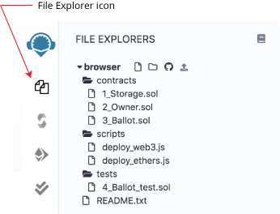
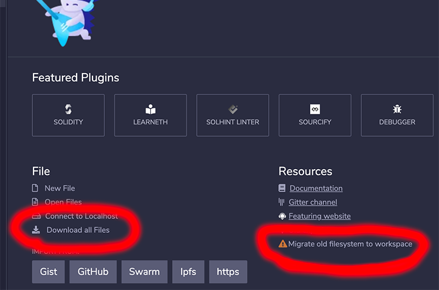
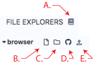
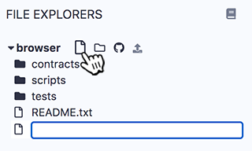
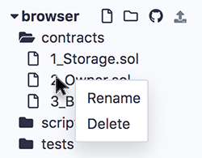
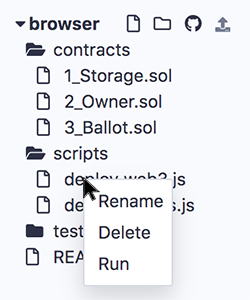

File Explorers
=============

To get to the File Explorers module - click the file explorers icon.

File Storage
------------
By default, Remix IDE stores files in **Workspaces** which are folders in your **browser's local storage**.  

**Important Note:** Clearing the browser storage will **permanently delete** all the files stored there. 

If you want to use browser storage, but also to save a git repo on IPFS, use the **DGIT** plugin.

If you want to store files on your computer's filesystem, use **[Remixd](remixd.html)** or use the **[desktop version of Remix-IDE](https://github.com/ethereum/remix-desktop/releases/)**. Remixd enables you to have access to a selected folder on your hard drive. Remix Desktop is a version of Remix-IDE in an Electron app. 

Workspaces
------------
Workspaces are new as of Remix IDE v0.11.0..  Workspaces should help clean up & organize your Files Explorer by allowing you to separate your projects.

The Files Explorer's Workspaces all have a contracts folder, a scripts folder, a tests folder, and a README.txt.

### Migrating your files to Workspaces
If you had files stored in browser storage in versions of Remix before v0.11.0 to get these files, you will need to click on the **Migrate old filesystem to workspace** link the Home Tab.  After you click on that, you'll get a modal asking if you want to migrate and download or just migrate the files.

Also note the **Download all files** link on the left of the Home tab. This link will download all files in your browser's local storage to your downloads folder.

Files Explorer Tour
-------------------

We will start by reviewing the icons in the image above.

The book icon - **A.** is the link to the documentation (this page).

### Workspace Manipulation
Add a Workspace **B.**  
Rename a Workspace **C.**  
Delete a Workspace **D.**  

## File Manipulation

Click on the new file icon (**E.**), an input for a new the file’s name will appear in the **Explorer**. Once a name is entered, the new empty file will open in the Editor.

When you click on the new file icon, the new file will be placed in the currently selected folder. If a file and not a folder is selected then the new file will be placed in that file’s folder. And if nothing is selected, then the file will be placed in the root of the current workspace's folder. Or to be brief — just be mindful of what folder it lands in.

Create a folder
---------------

The icon (marked **F.** above) creates a new folder in the current workspace.

Publish to Gist
---------------

The icon (marked **G.** above) publishes all files from the current Workspace to a gist.  Only file in the root of **browser** will be published.  Files in subfolders will not be published to the Gist.

Gist API **requires** users to be authenticated to be able to publish a gist.  

Click [this link](https://github.com/settings/tokens) to Github tokens setup and select Generate new token. Then check the **Create gists** checkbox and generate a new token. Also make sure you check the box to enable the creation of Gists with this token.

Take the token and paste it in Remix's **Settings** module in the **Github Access Token** section. And then click Save. **For the moment**, after saving, in order for the token to be registered, you will need to refresh Remix. In an upcoming release, it will not be necessary to do the refresh.

Upload to Browser Storage
---------------

Click the icon marked **H.** to upload a file from your computer's file system to your browser's local storage.

Right-Click on a File
----------------------

Right-clicking on a file will give you a context menu — offering you the possibility to delete or rename the file. 

You can rename or delete a selected file or a folder. You can also create a folder. 

Right-Click on a Folder
------------------------
To create a file with the context menu, right-click on a folder to get the **Create File** option. A file will be created inside that folder. 

The functionality of the context menu also works with RemixD (which gives you have access to a folder on your hard drive).  

**Note:** When working with RemixD, you need to open and close the **localhost** folder to refresh the view.

Right-Click on a Script
------------------------

Right-click on any file with a .js extension to get the **Run** option in the context menu to run the script.  The **Run** in the context menu is a shortcut.  The other way to get a script to run is to:
1. Click on the script to make it the active tab in the editor 
2. Input the command `remix.exeCurrent()` in the console.
