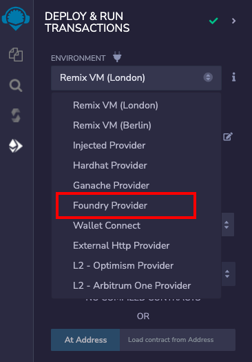
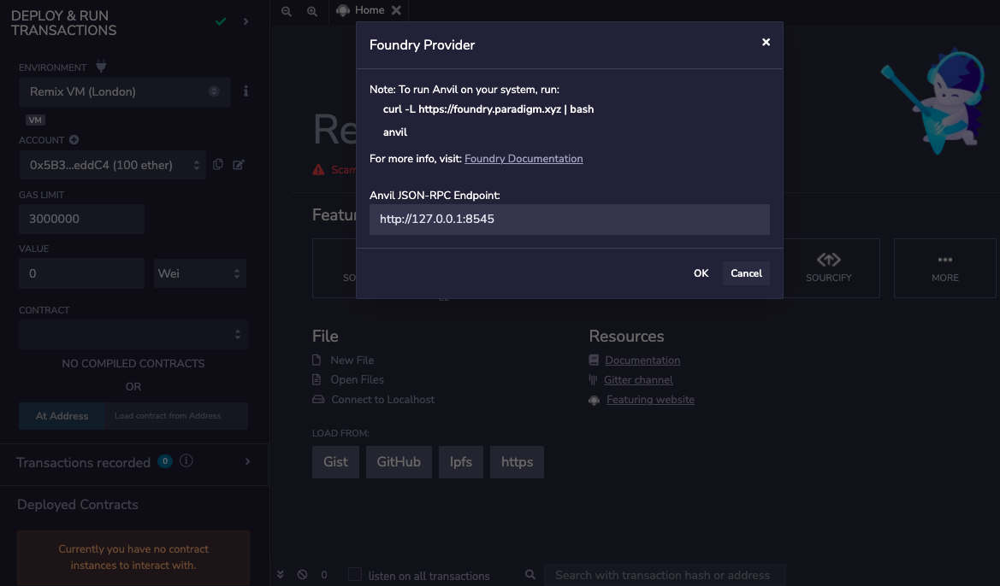
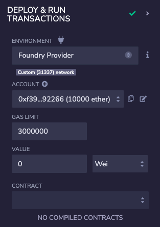
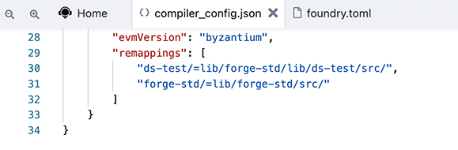

Foundry
============

Deploying to Anvil
------------------

To deploy to Anvil, Foundry's test chain, it needs to be running on your computer. Then select the **Foundry Provider** in the **Environments** section of the **Deploy & Run** module. 

As soon as you select `Foundry Provider`, a modal is opened asking for the `Anvil JSON-RPC Endpoint`.

If Foundry Anvil node is running with default options, the default endpoint value in modal doesn't need to be changed. If the Anvil node host and port are different, then the JSON-RPC endpoint should be updated in the modal's text box.

Once the correct endpoint is filled in the modal, just click on `OK` and the accounts from the Anvil node will be loaded in the `ACCOUNT` section. Network id will also be shown.

Now, one can start deploying the contract from Remix IDE to the local Anvil node as usual.

Foundry Remappings
------------------

Foundry manages dependencies using git submodules and can remap dependencies to make them easier to import. So import defined by remappings can have compilation errors on Remix IDE.

To support such compilation, Remix suggests running [compilation using a compiler config file](https://remix-ide.readthedocs.io/en/latest/compile.html#json-file-for-compiler-configuration). Remix adds some default Forge remappings in the compiler config file when a Foundry project is loaded in Remix IDE using remixd.

Further, more remappings can be added manually, if required.

