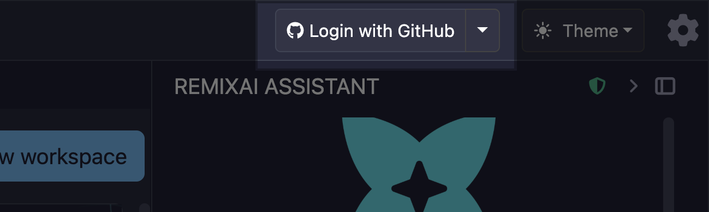
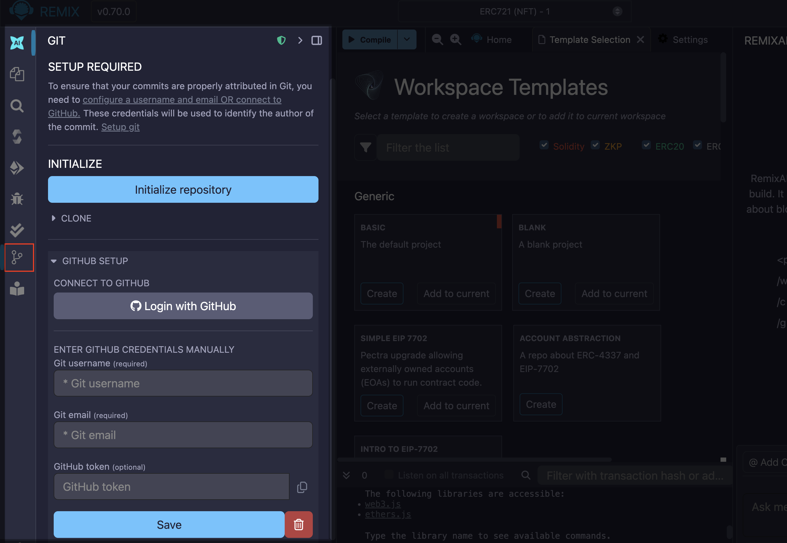
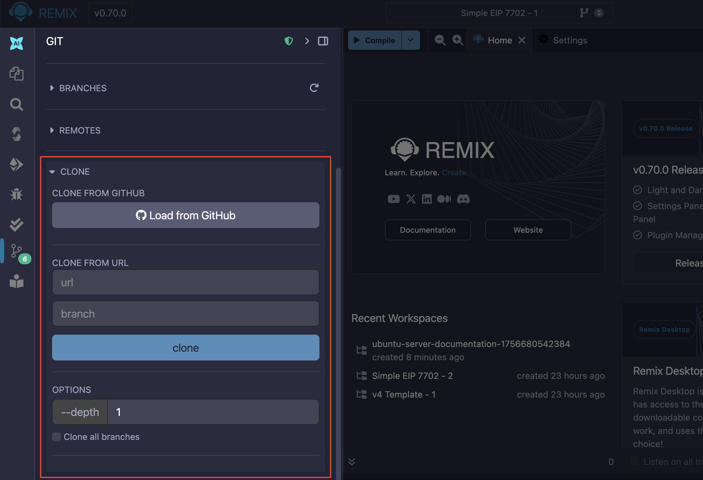
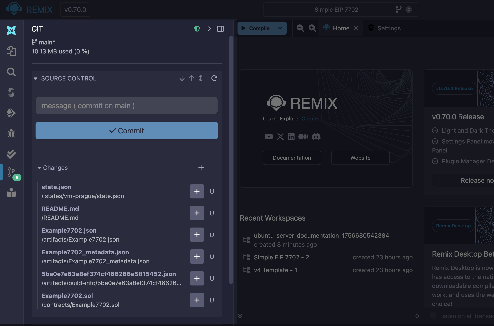
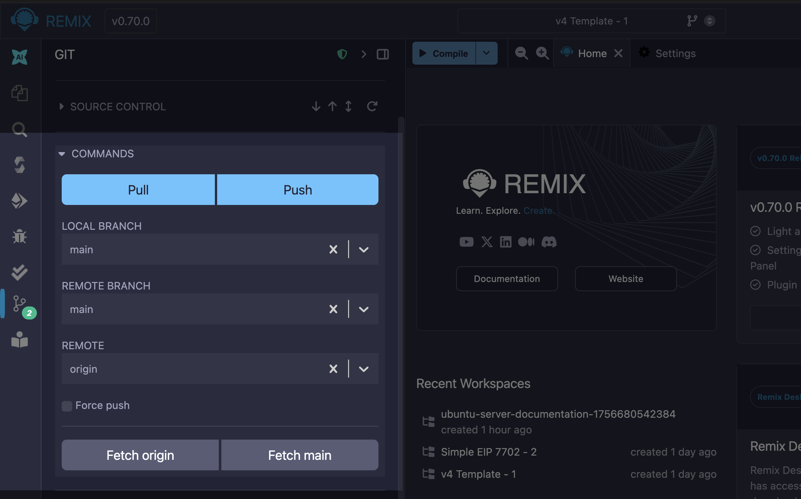
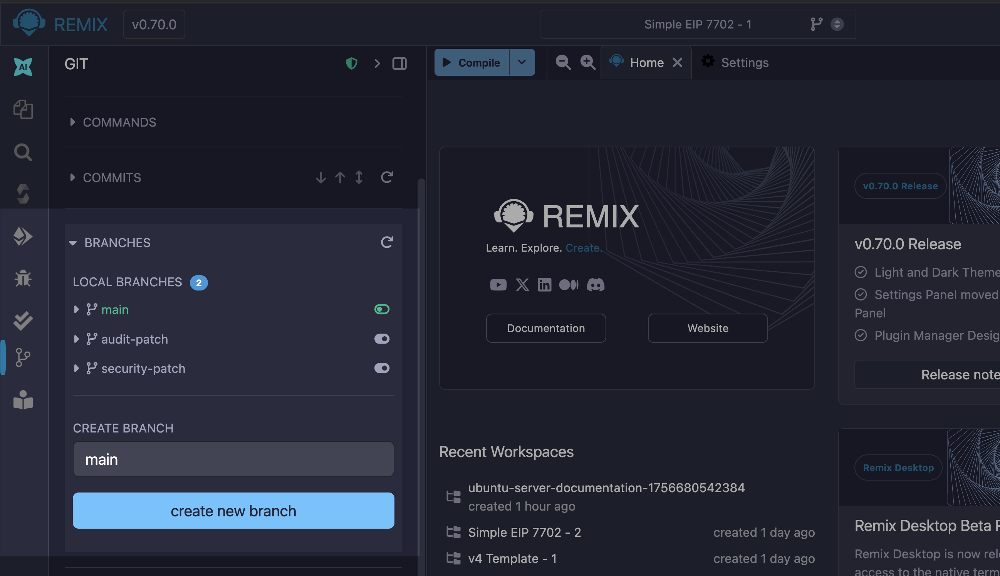
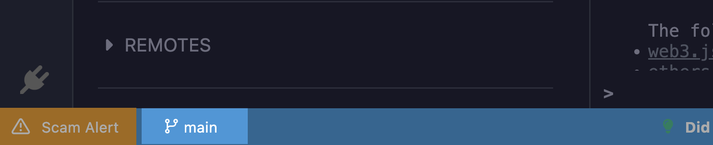

# Working with Git in Remix

In Remix, you can initialize Git for version control in your workspaces.

## Connecting to GitHub

Before you can use Git in any of your workspaces, you have to login with GitHub using the "**Login with GitHub**" button on the Top Bar.



Alternatively, you can add username and email to the Github section of the Git plugin. You can find the Git plugin on the Icon Panel represented by a branch icon.



## Initializing Git in a Workspace

For information about initializing a workspace, see the section about initializing Git on the [Remix Workspaces](/workspaces/#initializing-a-workspace-with-git) page.

## Git operations in Remix

### Cloning an existing repository into Remix

You can clone an existing repository from GitHub into Remix using "**CLONE**" accordion item in the Git plugin. You can clone a repository by loading it from GitHub using the "**Load from GitHub**" button and selecting one from your list of public repositories.

Alternatively, you can clone a repository by providing its URL in the "**CLONE FROM URL**" text box. When you clone a repository, Remix initializes it as a separate Workspace. See [Remix Workspaces](/workspaces) to learn more about Workspaces.

```{note}
Remix stores your files in the browser and browser storage is limited. Cloning a repository that is too large will cause the Remix IDE. This is why you have to manually specify the depth and branches you want to clone. If you are using [Remixd](/remixd) you don't have to worry about cloning large repositories.
```



### Committing changes to Git

You can commit the changes you made to your current Workspace using the "**SOURCE CONTROL**" accordion item in the Git plugin. Stage files individually using the plus icon next to them or all at once using the plus icon on the "**Changes**" dropdown label. Enter commit messages in the text box and commit the staged changes using the "**Commit**" button.



### Running common commands

The Git plugin has limited support for Git commands, as of Remix v0.70, you can run the following:

- `git push`
- `git push --force`
- `git fetch`
- `git pull`

You can run these commands through the "**COMMANDS**" accordion item in the Git plugin.



### Managing multiple branches

You can manage the multiple branches associated with your Workspace initialized with Git or cloned from GitHub from the "**BRANCHES**" accordion item.



You can view the current branch from the Footer.


