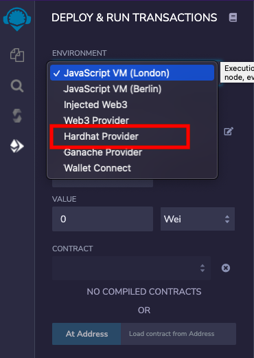

Hardhat Integration
============

Remixd and Hardhat
------------------

**Note:** If you have not used `remixd` before, read more about it [here](./remixd.html)

If `remixd` is running locally on device and shared folder is a hardhat project, one more websocket listener will be running on port `65522`. Definition of a hardhat project, according to its documentation:

> _Hardhat projects are npm projects with the hardhat package installed and a hardhat.config.js file._

Remixd hardhat listener is a websocket plugin similar to remixd and is used to perform Hardhat actions with Remix IDE. 

It doesn't need any extra installation as it is shipped with [remixd NPM](https://www.npmjs.com/package/@remix-project/remixd) module.

Enable Hardhat Compilation
------------------

If a hardhat project is shared through remixd and `localhost` workspace is loaded in Remix IDE, there will be an extra checkbox shown in `Solidity Compiler` plugin with the label `Enable Hardhat Compilation`.

One can check this box to run the compilation for hardhat along with the Remix. Result of the compilation will be shown in the Remix IDE terminal 

and remixd terminal both.

Hardhat Provider
------------------

_In hardhat, contracts are deployed starting a local node. Read more about it in [Hardhat documentation](https://hardhat.org/getting-started/#connecting-a-wallet-or-dapp-to-hardhat-network)_

**Hardhat Provider** is a plugin on Remix IDE which enables user to deploy the contract to hardhat 'localhost' network. This plugin can be activated from Remix IDE plugin manager.

Once you activate it, you will an extra option in the `ENVIRONMENT` dropdown of `Deploy and Run Transactions` plugin with the label `Hardhat Provider`

As soon as you select `Hardhat Provider`, a modal is opened asking the `Hardhat JSON-RPC Endpoint`.

If hardhat node is running with default options, default endpoint value in modal will not need any change. In case, hardhat node host and port are different, JSON-RPC endpoint should be updated in the modal text box.

Once correct endpoint is filled in the modal, just click on `OK` and accounts from hardhat node will be loaded in `ACCOUNT` section. Network id will also be shown.

Now, one can start deploying the contract from Remix IDE to hardhat local node as usual.

