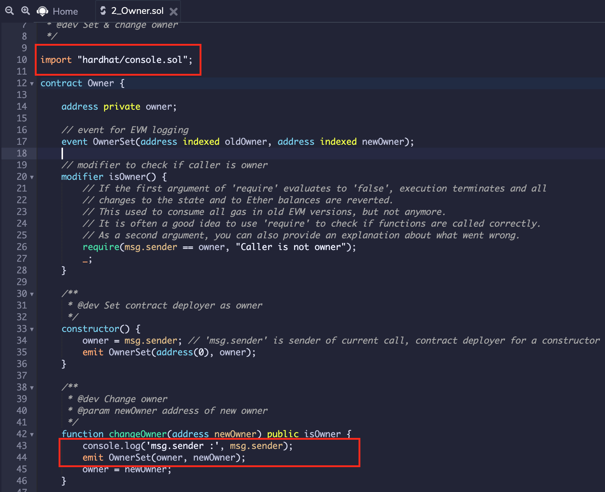

# Hardhat

_(Supported since Remix IDE v0.12.0 and Remixd v0.3.6)_

## Remixd and Hardhat

```{note}
If you have not used `remixd` before, read more about it {doc}`in the Remixd documentation </remixd>`.
```

If `remixd` is running locally on your device and shared folder is a **Hardhat project**, an additional websocket plugin will be listening on port `65522`. According to its documentation,

> _Hardhat projects are npm projects with the hardhat package installed and a hardhat.config.js or hardhat.config.ts file._

Remixd looks for the `hardhat.config.js` or `hardhat.config.ts` file in shared folder, and if it finds the file, the Hardhat websocket listener will run.

The Hardhat websocket listener is a websocket plugin similar to `remixd` and is used to perform Hardhat specific actions with Remix IDE.

It doesn't need any separate installation as it is shipped with [remixd NPM](https://www.npmjs.com/package/@remix-project/remixd) module.


## Enable Hardhat Compilation

### Prerequisites

To use Hardhat compilation with Remix IDE efficiently:

1. **Hardhat** should be installed locally on the system [https://hardhat.org/getting-started/#installation](https://hardhat.org/getting-started/#installation)
2. Shared folder should be a Hardhat project containing `hardhat.config.js` or `hardhat.config.ts`
3. `Remixd` Hardhat websocket listener should be running at `65522`

### How to use

If a hardhat project is shared through Remixd and `localhost` workspace is loaded in Remix IDE, there will be an extra checkbox shown in `Solidity Compiler` plugin with the label `Enable Hardhat Compilation`.


There is an info icon alongside the label which redirects to a specific section of Remix official documentation that explains how to use Hardhat compilation.

One can check the `Enable Hardhat Compilation` box to run the compilation for Hardhat along with the Remix using the compiler configuration in `Solidity Compiler` plugin.

On clicking `Compile` button, a file with `remix-compiler.config.js` will be created on the project root which will be storing compiler configuration set in Remix's `Solidity Compiler` plugin. It is passed to Hardhat for compilation.

The result of the compilation will be shown in the Remix IDE terminal


and also in the **remixd** terminal.


## Hardhat Provider

_In Hardhat, contracts are deployed by starting a local node. Read more about it in [Hardhat documentation](https://hardhat.org/getting-started/#connecting-a-wallet-or-dapp-to-hardhat-network)_

**Hardhat Provider** is a plugin on Remix IDE which enables users to deploy the contract to the Hardhat 'localhost' network. This can be chosen from the `ENVIRONMENT` dropdown of `Deploy and Run Transactions` plugin.


As soon as you select `Hardhat Provider`, a modal is opened asking for the `Hardhat JSON-RPC Endpoint`.


If Hardhat node is running with default options, then the default endpoint value in modal will not need any change. In case, Hardhat node host and port are different, JSON-RPC endpoint should be updated in the modal text box.

Once the correct endpoint is filled in the modal, just click on `OK` and the accounts from the Hardhat node will be loaded in the `ACCOUNT` section. Network id will also be shown.


Now, one can start deploying the contract from Remix IDE to the Hardhat local node as usual.

## `console.log` in Remix IDE

_(Supported since Remix IDE v0.17.0)_

Remix IDE supports hardhat console library while using `Remix VM`. It can be used while making a transaction or running unit tests.

### Deploy and Run Transactions

To try it out, you need to put an import statement and use `console.log` to print the value as shown in image.



Further, once you execute the `changeOwner` method, the value from console statement will be shown in Remix terminal after transaction details as below:


### Solidity Unit Testing

Similarly, `console.log` can be used while running unit tests using Remix Solidity Unit Testing plugin. See image below.


For the tests including logging message, it will display in the Remix Terminal corresponding to test name.


