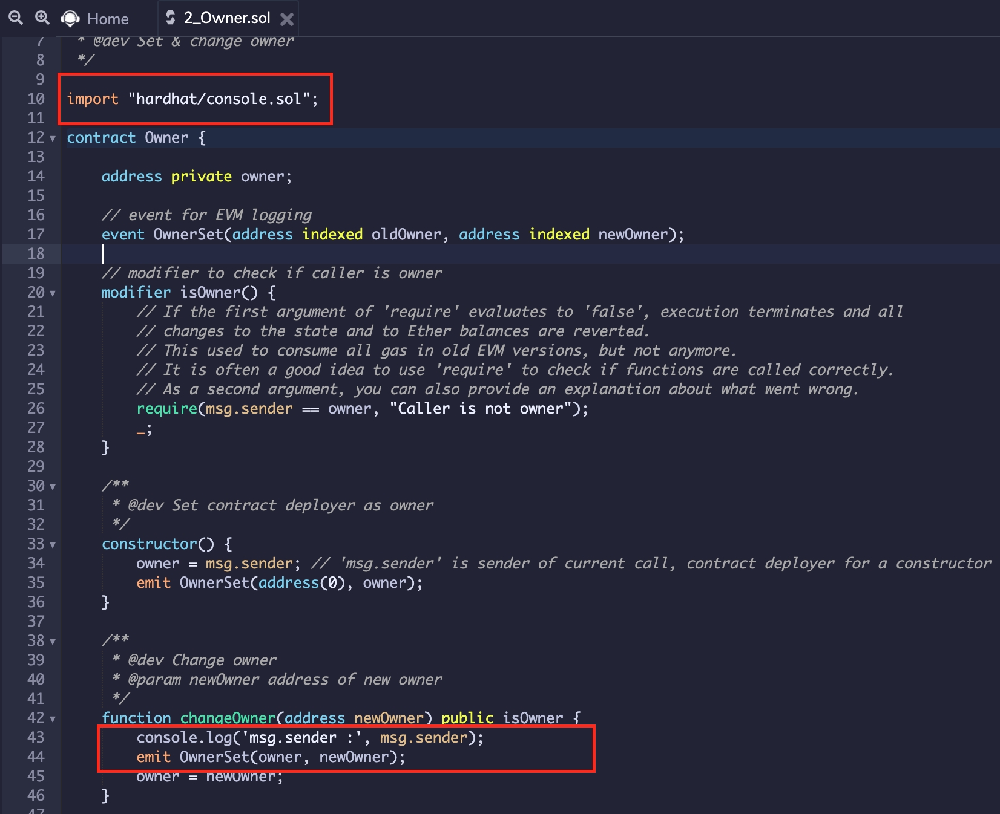
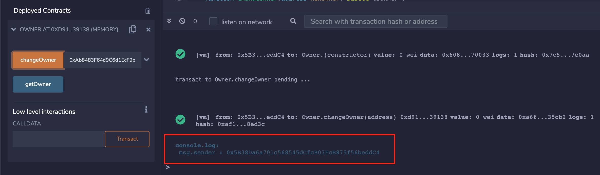
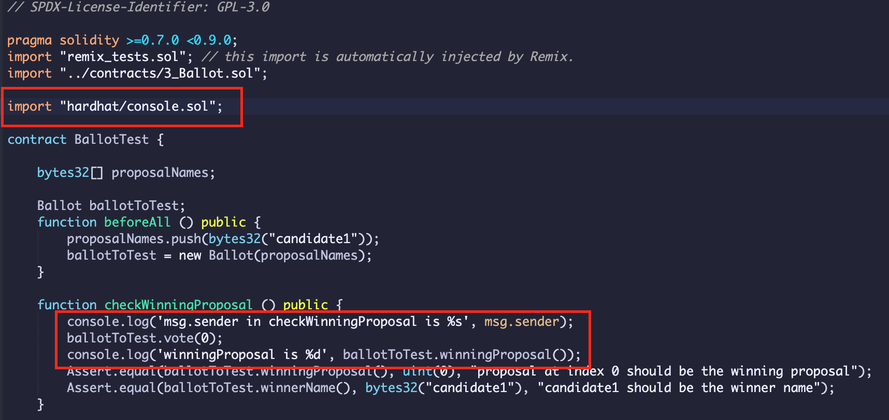
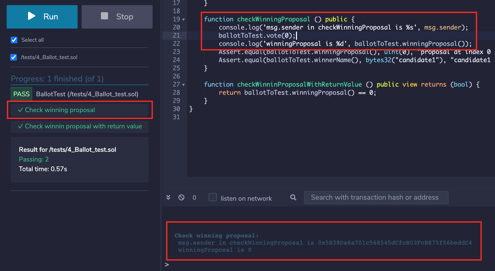

Hardhat console.log Integration
============

_(Supported since Remix IDE v0.17.0)_

Prologue
---------
_Hardhat Network allows you to print logging messages and contract variables by calling console.log() from your Solidity code. To use it, you simply import `hardhat/console.sol` and call it._

For more: [https://hardhat.org/hardhat-network/reference/#console-log](https://hardhat.org/hardhat-network/reference/#console-log)

`console.log` in Remix IDE
---------------------------

Remix IDE supports hardhat console library while using `JavaScript VM`. It can be used while making a transaction or running unit tests.

### Deploy and Run Transactions

To try it out, you need to put an import statement and use `console.log` to print the value as shown in image.

Further, once you execute the `changeOwner` method, value from console statement will be shown in Remix terminal after transaction details as below:

### Solidity Unit Testing

Similarly, `console.log` can be used while running unit tests using Remix Solidity Unit Testing plugin. See image below.

For the tests including logging message, it will display in the Remix Terminal corresponding to test name.

