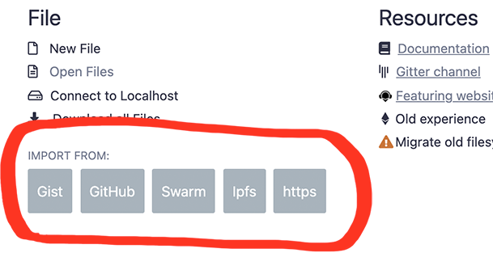
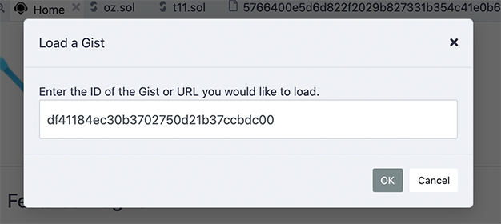

# Importing & Loading Source Files in Solidity

There are two main reasons for loading external files into Remix:

- **to import a library or dependency** (for files you will NOT be editing)
- **to load some files for manipulation, editing and play** (for files you might want to edit)

## Importing a library or dependency

When importing from NPM, or a URL (like github, an IPFS gateway, or a Swarm gateway) you do not need to do anything more than use the `import` statement in your contract. The dependencies do not need to be "preloaded" into the File Explorer's current Workspace before the contract is compiled.

Files loaded from the import statement are placed in the **Files Explorer's** current Workspace's `.deps` folder.

Under the hood, Remix checks to see if the files are already loaded in the **.deps** directory. If not, it gets them via unpkg if it is an NPM lib.

Here are some example import statements:

### Import from NPM

```Solidity
import "@openzeppelin/contracts/token/ERC20/ERC20.sol";
```

```Solidity
import "@openzeppelin/contracts@4.2.0/token/ERC20/ERC20.sol";
```

**Note:** In the example above, **@openzeppelin** is the name of the npm library. In the following example the library's name does not begin with an @ - but Remix will go and check npm for a library of that name.

```Solidity
import "solidity-linked-list/contracts/StructuredLinkedList.sol";
```

### Import from a Github URL

```Solidity
import "https://github.com/OpenZeppelin/openzeppelin-contracts/blob/v2.5.0/contracts/math/SafeMath.sol";
```

You should specify the release tag (where available), otherwise you will get the latest code in the master branch. For OpenZeppelin Contracts you should only use code published in an official release, the example above imports from OpenZeppelin Contracts v2.5.0.

### Import from Swarm

```Solidity
import 'bzz-raw://5766400e5d6d822f2029b827331b354c41e0b61f73440851dd0d06f603dd91e5';
```

### Import from IPFS

```Solidity
import 'ipfs://Qmdyq9ZmWcaryd1mgGZ4PttRNctLGUSAMpPqufsk6uRMKh';
```

### Importing a local file not in .deps

To import a file NOT in the **.deps** folder, use a relative path (**./**). For example:

```Solidity
import "./myLovelyLovelyLib.sol";
```

**Note:** It is not possible to import across Workspaces.

### Importing a file from your computer's filesystem

This method uses **remixd** - the remix daemon. Please go to the {doc}`remixd docs </remixd>` for instructions about how to bridge the divide between the browser and your computer's filesystem.

### More about the import keyword

For a detailed explanation of the `import` keyword see the
[Solidity documentation](https://docs.soliditylang.org/en/latest/layout-of-source-files.html?highlight=import#importing-other-source-files)

## Importing files for manipulation

When importing from the home tab widgets or with a remix command in the console, the files are placed in the **root of the current Workspace** inside a folder that shows their source - eg github or gists.

### Import buttons on the Remix home tab

The Gist, Github, Swarm, IPFS, & HTTPS buttons are to assist in getting files into Remix so you can explore.



Clicking on any of the Import buttons will bring up a modal like this one:



No need to wrap the input in quotes.

### Loading with a remix command in the console

The 2 remix commands for loading are:

- remix.loadurl(url)
- remix.loadgist(id)

```Solidity
remix.loadurl('https://github.com/OpenZeppelin/openzeppelin-contracts/blob/v2.5.0/contracts/math/SafeMath.sol')
```

```Solidity
remix.loadgist('5362adf2000afa4cbdd2c6d239e06bf5')
```

### Accessing files loaded from the Home tab or from a remix command

When you load from github, a folder named `github` folder is created in the root of your current workspace. To import a file from the `github` folder, you would use a command like this:

```Solidity
import "github/OpenZeppelin/openzeppelin-contracts/contracts/math/SafeMath.sol";
```

Notice that this import statement doesn't include the version information that was in the remix.load(url) command. So it is recommended that you use the methods described at the top of this page for importing dependencies that you are not intending to edit.

Assume the .sol file that contained the import statement above is in the contracts folder. Notice that this import statement didn't need to traverse back to the github folder with a relative path like: **../github**.
