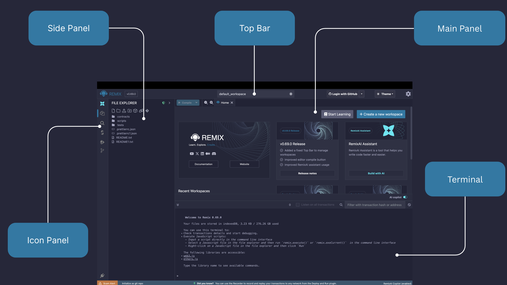
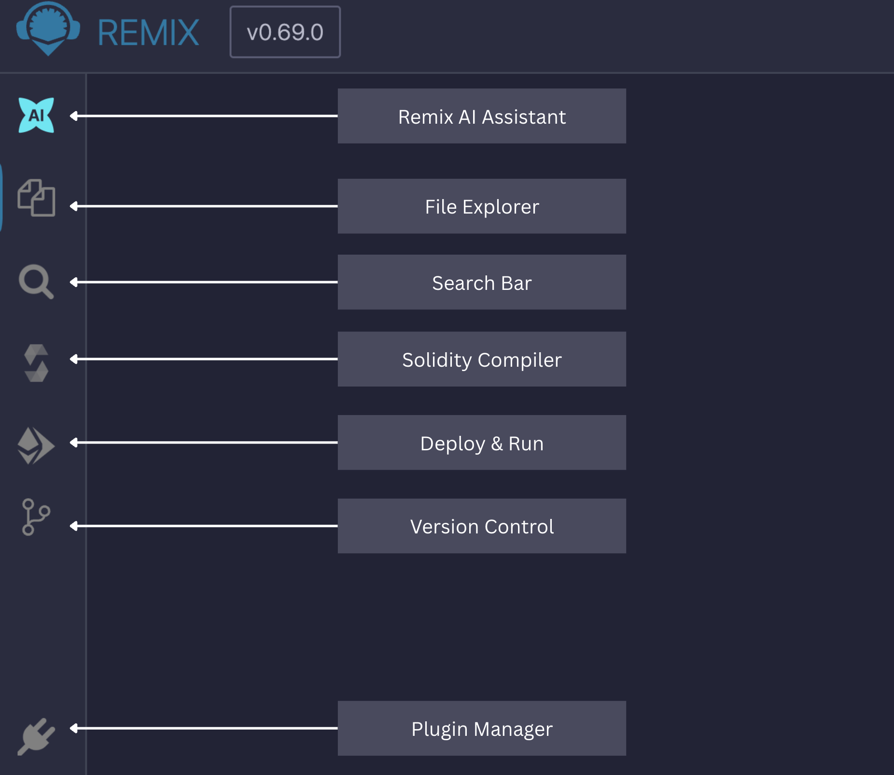
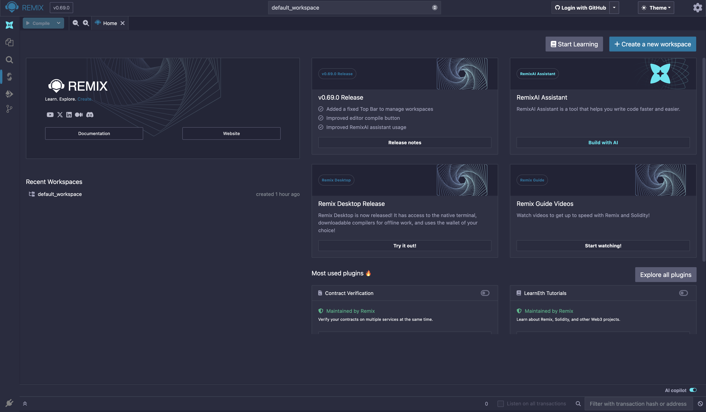

# Navigating Remix

Remix's layout consists of the following components: the top bar, icon panel, Side Panel, Main Panel, and terminal.

- Top Bar - interface for workspace selection, GitHub authentication and associated tools, themes, and the settings panel.
- Icon Panel - indicates which plugins have been activated and which plugin is currently in the left or Right Side Panel. Click an icon to select that plugin. Go to the Plugin Manager to activate other plugins.
- Side Panel - interface for the File Explorer, Solidity Compiler, Git, Deploy & Run, and many other plugins. Visit the Plugin Manager for a full list of plugins.
- Main Panel - contains tabs for editing files, Main Panel plugins (plugins that require more space than Side Panel plugins), and the Home Tab.
- Terminal - a panel for viewing transaction receipts, various logs, and for executing JavaScript scripts.

## Default Tools

When the Remix IDE is loaded for the first time - the Icon Panel shows these icons by default.

When you load more plugins, that icons automatically appear in the icon panel. To load more plugins go to the **[Plugin Manager](#plugin-manager)** and select a plugin from the list of available plugins.

## Home Tab

The Home Tab is located in the Main Panel. It can be closed, just like any of the Main Panel tabs. You can also access it (even if closed) by clicking the Remix logo at the top of the icon panel.

The home tab contains links to resources, announcements, tutorials, featured plugins and methods for loading files into Remix and shortcuts for connecting Remix to your local filesystem.

## Plugin Manager

In Remix, you only need to load the functionality you need - and the Plugin Manager is where you manage what plugins are turned off or on.

The Plugin Manager is also the place you go when you are creating your own plugin and you want to load your local plugin into Remix. In that case, you'd click on the "Connect to a Local Plugin" link at the top of the Plugin Manager panel.
