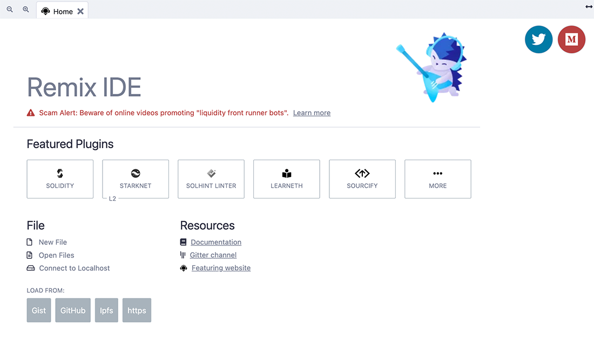
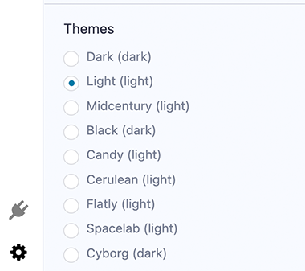

Navigating Remix
================
Remix IDE is comprised of three panels and a terminal.

1. Icon Panel - click to change which plugins appear in the Side Panel
2. Side Panel - most but not all plugins have their interface here
3. Main Panel - for editing files, large format tools, and the home tab
4. Terminal - for viewing transaction receipts and various logs

Default Tools
-----------------------

When Remix is loaded - the icon panel shows these icons by default.

To load more plugins go to the **[Plugin Manager](#plugin-manager)** or click on one of the featured plugins in the home tab.

Home tab
--------

The home tab is located in the Main Panel.  It can be closed, just like any of the main panel tabs.    You can also access it (even if closed) by clicking the Remix logo at the top of the icon panel.

The home tab contains links to resources, announcements, tutorials, featured plugins and methods for loading files into Remix and shortcuts for connecting Remix to your local filesystem. 

### Solidity 
Clicking the **Solidity button** in the featured plugins section of the home tab will activate  **Solidity Static Analysis** and **Solidity Unit Testing** as well as the Solidity Compiler and Deploy & Run (which are there by default).

To see all the plugins go to the **Plugin Manager** - by selecting the plug in the icon panel.
  
You can also get there by clicking the **More** button in the featured plugin list.

Plugin Manager
---------------

In Remix, you only need to load the functionality you need - and the Plugin Manager is where you manage what plugins are turned off or on.

The Plugin Manager is also the place you go when you are creating your own plugin and you want to load your local plugin into Remix. In that case you'd click on the "Connect to a Local Plugin" link at the top of the Plugin Manager panel.

Themes
---------------

Themes are chosen at the bottom of the **Settings** plugin. These are Bootstrap-based themes. The Dark and Light themes are most customized for Remix.

 
