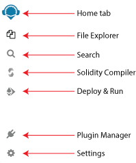

Remix-IDE Layout
==============

The new structure
--------------------

1. Icon Panel - click to change which plugin appears in the Side Panel
2. Side Panel - Most but not all plugins will have their GUI here.
3. Main Panel - In the old layout this was just for editing files.  In the tabs can be plugins or files for the IDE to compile.
4. Terminal - where you will see the results of your interactions with the GUI's.  Also you can run scripts here.

Icon Panel at Page Load
-----------------------
When you load remix - the icon panel show these icons by default.

Everything in Remix is a plugin...  so the **[Plugin Manager](#plugin-manager)** is very important.

Home tab
--------

The home tab is located in the Main Panel.  It can be closed.    You can also access it (even if closed) by clicking the Remix logo at the top of the icon panel.

The hometab contains links to resources - including links to these docs as well as our Twitter feed, our Medium blog, gitter chat and more.  There are also shortcuts for loading files into Remix.  

### Solidity Environment
Clicking the **Solidity button** in the featured plugins section of the home tab will activate  **Solidity Static Analysis** and **Solidity Unit Testing** as well as the Solidity Compiler and Deploy & Run (which are there by default).

To see all the plugins go to the **Plugin Manager** - by selecting the plug in the icon panel.
  
You can also get there by clicking the **More** button in the featured plugin list.

Plugin Manager
---------------

In Remix, you only need to load the functionality you need - and the Plugin Manger is where you manage what plugins are turned off or on.

The Plugin Manager is also the place you go when you are creating your own plugin and you want to load your local plugin into Remix. In that case you'd click on the "Connect to a Local Plugin" link at the top of the Plugin Manager panel.

Themes
---------------

So you want to work on Remix with a dark theme or a light theme or just a different theme than the one you are currently looking at?  At the bottom of the **Settings** plugin is where you can choose a theme. These are bootstrap based themes.  The Dark and Light theme have been the most customized for Remix.

 
