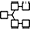

# Plugin List

Here is the list of remix plugins:

## Base Plugins
**File Explorer** &nbsp;    File Tree  
The File Explorers is where you can see the files.

Solidity Compiler

Deploy & Run

Debugger

Solidity Static Analysis

Solidity Unit Testing

3Box (Should this one not be included?)

**Celo Compiler / Deployer** &nbsp;  &nbsp; Compiler  
The Celo Compiler is for use on the Celo blockchain.

**Control Flow Graph** &nbsp;    &nbsp; Compilation Result  
The Control Flow Graph graphs the organization of the smart contract.

Debug Tools for Remix  

Debugger

**Defi Explorer**  &nbsp;  &nbsp;  File Loading   
The Defi Explorer loads the Uniswap V2 Protocol into the File Explorers.

**Defi Tutorials**  &nbsp; (main panel) &nbsp;  Tutorials   
Learn about UMA. 

**DGIT** (main panel) &nbsp;  Version Control   
Create GIT repos and export/import to IPFS

EthDoc Documentation Generator

EthDoc Viewer

Etherscan Contract Verifier

Flattener

Gas Profiler

HardHat Provider

Learneth

Lexon

Moonbeam

Mythx Security Verification

One Click Dapp

Optimism Compiler

Proveable Oracle Services

Quorum Network

Remixd

Restore Backup Zip

Slither

Solhint

Solidity Unit Testing

Solidity Static Analysis

Sourcify

Tenderly

UMA Playground

UMA Tutorials

Vyper Compiler

Wallet Connect

YUL+

Zokrates

