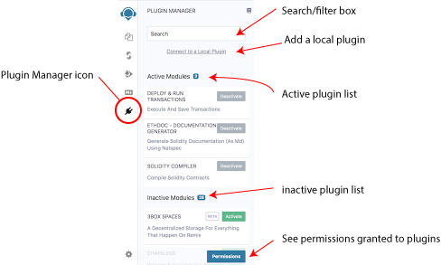
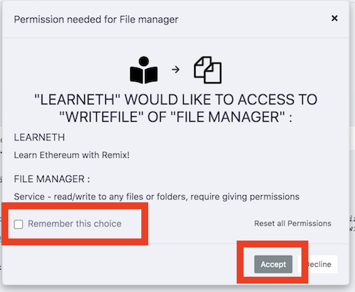
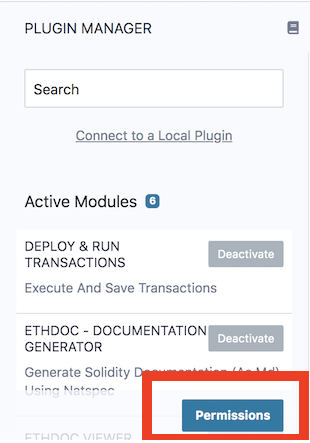
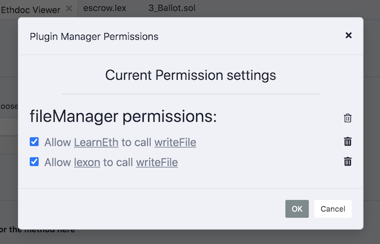

Plugin Manager
===================

In Remix IDE you only load the functionality you need.  Controlling which plugins are active or inactive happens in the **Plugin Manager**.

This plugin architecture has made it possible to integrate tools made by the Remix team with tools made by external teams. This architecture also allows Remix or just parts of Remix to be integrated into other projects.   

## Manage permissions
When plugins need to access other plugins for their operation, a modal will appear to ask you for permission.  

Often, the same plugin will want to do the same action multiple times.  So when granting permission, its helpful to click the **Remember this choice** box.  If you don't, you might get this modal repeatedly popping up.

## View permissions
You can view the permissions that you have granted to plugins by clicking on the **Permissions** button at the bottom of the **Plugin Manager**.

A modal will appear like the one below where you can view and erase the granted permission.

## Plugin Devs: Load a local plugin

 A plugin in development can be loaded into Remix IDE by clicking the "Connect to a Local Plugin" link at the top of the Plugin Manager panel.

To learn more about how to create your own plugin, go to
[the README of remix-plugin repo](https://github.com/ethereum/remix-plugin).
