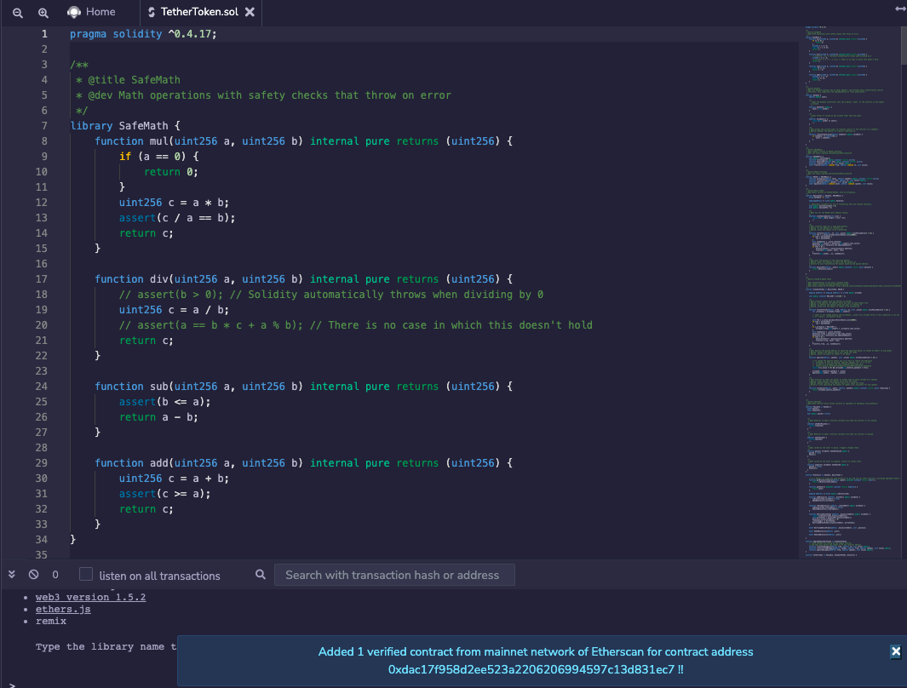
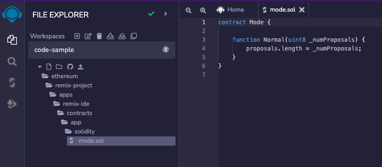

Remix as code viewer
=============================

Through Etherscan
------------------

Verified contracts on Etherscan can be viewed in Remix by making a simple change to the URL. Mostly for a multiple part contract verification, Remix provides a quick way to load all the contracts.

A typical Etherscan URL for a contract address looks like this:

`https://etherscan.io/address/0xdac17f958d2ee523a2206206994597c13d831ec7`

In the URL, change `etherscan.io` to `remix.ethereum.org`

`https://remix.ethereum.org/address/0xdac17f958d2ee523a2206206994597c13d831ec7`

and reload. It will fetch the contracts verified on Etherscan.

Contracts verified on Ethereum mainnet and on other test networks (Ropsten, Rinkeby, Kovan & Goerli) will be loaded in respective directories under `etherscan-code-sample` workspace. 

This works for Etherscan testnet URLs `https://ropsten.etherscan.io`, `https://goerli.etherscan.io/` etc. If they are similarly updated, contracts will be loaded in Remix. 

Through GitHub
------------------

Solidity files in GitHub can be loaded on Remix with a similar tweak. For a file with URL like:

`https://github.com/ethereum/remix-project/blob/master/apps/remix-ide/contracts/app/solidity/mode.sol`

change `github.com` to `remix.ethereum.org` like:

`https://remix.ethereum.org/ethereum/remix-project/blob/master/apps/remix-ide/contracts/app/solidity/mode.sol`

and reload. It will open the same file in Remix IDE.

