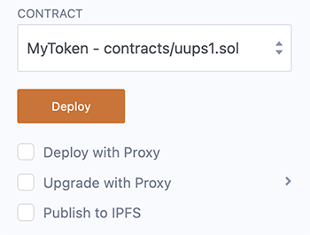
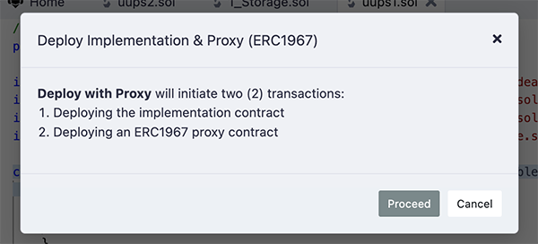
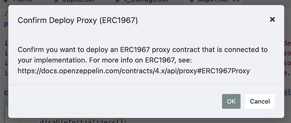
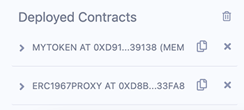
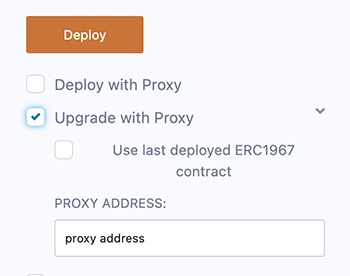

Deploy & Run Proxy Contracts
============================

Remix IDE has the functionality to assist in the handling of proxy contracts that use the UUPS pattern.

A UUPS proxy contract is the implementation side of an [ERC1967Proxy](https://eips.ethereum.org/EIPS/eip-1967).  

Once you have deployed a UUPS implementation contract, Remix will deploy an ERC1967 with your implementation contract's address.  

To interact with the functions in the **implementation contract**, use the deployed instance of the **ERC1967 instance** not on the implementation contract.  

When it's time to upgrade your contract, Remix has a UI for this.  

To try this out, you will need to get a proxy contract. Go to wizard.openzeppelin.com and select a contract. Then, in the Upgradeability section, check the UUPS option. Then, copy and paste the file into Remix.  Compile the file and go to Deploy & Run.

## Deploying
When a UUPS contract is selected in Deploy & Run's Contract select box, you'll see some checkboxes below the Deploy button:

Check the box for **Deploy with Proxy**. This will create two transactions: one for the implementation (your contract) and the other for the ERC1967 proxy contract. You will get two modals to check through:

and then

If you are deploying to the **Remix VM**, these modals will appear one after the other. If you are connected to the mainnet or a public testnet, then the second modal will appear after the first transaction has gone through.

After the ERC1967 proxy contract is deployed, in the Deployed Contracts section, you'll see two deployed instances.

To interact with your implementation contract **DO NOT** use the instance of your contract. Instead, you should **use the ERC1967 Proxy**. The proxy will have all the functions of your implementation.

## Upgrading

To upgrade, check the Upgrade with Proxy box and dial down the caret to see the options:

You'll either need to use the last deployed ERC1967 contract, or input the address of the ERC1967 contract that you want to use.
