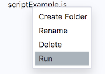

Running Scripts
===============

Remix IDE supports execution of JS & TS scripts.

## Write & Run a script

Create a file with `.js` or `.ts` extension and put your logic inside it. To run a script either:

- Click the green play button in the upper left of the Editor.

- Right click on the script name in the `File Explorers` and click on the **Run** option. 

- `Ctrl+Shift+S` when the script is displayed in the editor.

- Make the script the active file in the editor and run `remix.exeCurrent()` from Remix terminal

Here is a sample .js script:

```
function test() {
  var num=12;
  if(num<10)
    console.log(num + " is less than 10");
  else
    console.log(num + " is not less than 10");
}

test();
```

Running it using one of options mentioned above will show result in Remix terminal



## Why run scripts in Remix?
* To mimic how the front-end of your dapp will use web3.js or ethers.js
* To quickly deploy and interact with a bunch of instances of a contract without going through the Remix GUI.
* To run some tests on a previous deployed contract.

## Script to deploy a contract 

Remix accepts async/await scripts to run [web3.js](https://web3js.readthedocs.io/)  or [ethers.js](https://docs.ethers.io/) commands. The script needs to be wrapped in a self executing function.

## Setup
1. These scripts will need to access the contract's ABI.  The ABI is located in the contract's metadata file. Make sure that this metadata file will be created by going to the **Settings** module and checking that the **Generate contract metadata** option is indeed **checked**.

2. Compile a Solidity file - to generate the contract metadata.

3. In the Deploy & Run plugin, choose the Environment. 
    * Async/await scripts work on in all of the Environments: the Remix VM, Injected Provider (usually MetaMask), and External HTTP Provider. 

## JS Scripts in the File Explorers
In the **scripts** folder of a **workspace**, there are 2 example files: one using **web3.js** and the other using **ethers.js**.

## Compile a contract and run a script in one click
When drafting a contract, it can be helpful to run a script just after the compilation succeeds.

With this technique, one can write some code then quickly deploy and set the state of the contracts.

The script can contains Mocha tests to be run.

In order to connect a contract with a script, add the **NatSpec** tag `@custom:dev-run-script` to the contract followed by the absolute file path, like:

```
  /**
   * @title ContractName
   * @dev ContractDescription
   * @custom:dev-run-script file_path
   */
  contract ContractName {}
```

When you are ready to deploy the code for real, remove the NatSpec comment `@custom:dev-run-script`.

**ShortCut**: `Ctrl+Shift+S` , when editing a solidity file, will compile that file and then will run the script. In contrast, Ctrl+S will only start the compiling.

## An Example Script
The example below deploys a solidity contract named **CustomERC20.sol**. This example is using the web3.js library.  Ethers.js could also be used.

For more information about this example, please see: [running async/await scripts](https://medium.com/remix-ide/running-js-async-await-scripts-in-remix-ide-3115b5dd7687?source=friends_link&sk=04e650dfa65905fdab0ecd5b10513d41)

```
(async () => {
  try {
    console.log('deploy...')

    // Note that the script needs the ABI which is generated from the compilation artifact.
    const metadata = JSON.parse(await remix.call('fileManager', 'getFile', 'browser/artifacts/CustomERC20.json'))
    const accounts = await web3.eth.getAccounts()

    let contract = new web3.eth.Contract(metadata.abi)

    contract = contract.deploy({
      data: metadata.data.bytecode.object,
      arguments: ["Mask", "N95"]
    })

    newContractInstance = await contract.send({
      from: accounts[0],
      gas: 1500000,
      gasPrice: '30000000000'
    })
    console.log(newContractInstance.options.address)
  } catch (e) {
    console.log(e.message)
  }
})()
```

For more script examples, please see [Frequently Asked Scripts](FAS.html).

## `require` in scripts at Remix

`require` or `import`statement is supported in a limited manner for Remix supported modules with Remix Scripts.

For now, modules supported by Remix are:
- ethers
- web3
- swarmgw
- chai
- starknet
- multihashes
- zokrates-js
- snarkjs
- circomlibjs
- @zk-kit/incremental-merkle-tree
- @semaphore-protocol/proof
- @semaphore-protocol/group
- @semaphore-protocol/identity
- @semaphore-protocol/data
- @chainlink/functions-toolkit
- @personaelabs/spartan-ecdsa
- @ethereumjs/util
- ffjavascript
- sindri
- remix
- hardhat (only for hardhat.ethers object)

For unsupported modules, this error `<module_name> module require is not supported by Remix IDE` will be shown.
