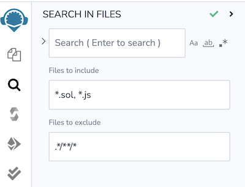
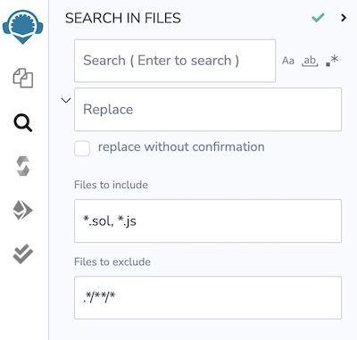

Search in Files
================
The **Search in Files** plugin is loaded by default.  It also includes functionality to search & replace as well as searching with regular expressions.

This plugin searches through text in the files of the current workspace.  It does not search across workspaces.

## Search and Replace
Clicking on the caret to the left of the text input box will reveal the **replace** functionality.

