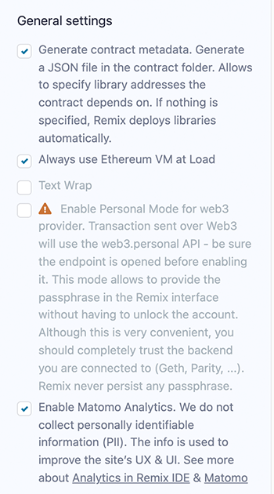
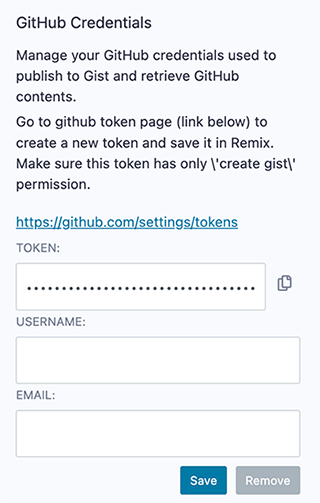
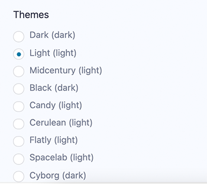

Settings
========

To get to **Settings** click the gear at the very bottom of the icon panel. 

### General Settings 

-  Generate contract metadata is used for deploying with libraries.  See our blog post on the subject: [Deploying with Libraries](https://medium.com/remix-ide/deploying-with-libraries-on-remix-ide-24f5f7423b60?sk=68f9c2bf318e85e129e46fe44683a730)
- Always use Ethereum VM at Load: will make the Javascript VM the selected **environment** when Remix loads.
-  Text wrap: controls if the text in the editor should be wrapped.
-  Personal mode: can be used when one is connecting to a **local node**.  It is used to have Remix temporarily save the passphrase - so that you don't need to **unlock** the account in GETH.  Remix will not persist the passphrase - so if you refresh your browser the passphrase will be gone.
-  Matomo Analytics: This is where you can turn off and on your approval for us to use Matomo.  We do not collect any personally identifiable information (PII) and our reports are public.  See our [blog post on the subject](https://medium.com/remix-ide/help-us-improve-remix-ide-66ef69e14931?source=friends_link&sk=cf9c62fbe1270543eb4bd912e567e2d6).

### Github Access Token

For creating GISTs as well as using other Github functions, it is necessary to put in an access token.  [https://github.com/settings/tokens](https://github.com/settings/tokens)

### Themes
Choose themes here.  The Dark & Light themes are the themes that the Remix team actively maintains.

