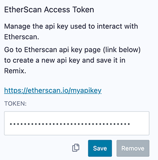

Settings
========

To get to **Settings** click the gear at the very bottom of the icon panel. 

### Reset Button
The Reset button at the top of the Setting panel will reset all of the settings back to the default.    
### General Settings 

-  Generate contract metadata is used for deploying with libraries.  See our blog post on the subject: [Deploying with Libraries](https://medium.com/remix-ide/deploying-with-libraries-on-remix-ide-24f5f7423b60?sk=68f9c2bf318e85e129e46fe44683a730)
- Always use Remix VM at Load: will make the Remix VM the selected **environment** when Remix loads.
-  Text wrap: controls if the text in the editor should be wrapped.
-  Personal mode: can be used when one is connecting to a **local node**.  It is used to have Remix temporarily save the passphrase - so that you don't need to **unlock** the account in GETH.  Remix will not persist the passphrase - so if you refresh your browser the passphrase will be gone.
-  Matomo Analytics: This is where you can turn off and on your approval for us to use Matomo.  We do not collect any personally identifiable information (PII) and our reports are public.  See our [blog post on the subject](https://medium.com/remix-ide/help-us-improve-remix-ide-66ef69e14931?source=friends_link&sk=cf9c62fbe1270543eb4bd912e567e2d6).

### Github Access Token

When performing Git operations on Github and when creating GISTs, it may be necessary to input an access token.  This token has the specific permissions for your Git commands. Depending on the operation, you may also need to input your Github username & email address.  Remix does not save your password info outside of your browser's localstorage.  [https://github.com/settings/tokens](https://github.com/settings/tokens)

### Etherscan Access Token

You need to input your Etherscan access token when debugging verified contracts with the Remix Debugger.  When verifying a contract with the Etherscan plugin, you need to put the API key in that plugin and not in the Settings panel.   

Click [here](https://etherscan.io/myapikey) to get your Etherscan API key.

### Swarm Settings

In the Solidity Compiler, after the compilation is completed, there is a button to publish to Swarm.  

Without putting in an address & postage stamp, you'll be using the public gateway, which may not persist your content as surely as if you put in your own info.

### IPFS Settings

Just like the Swarm settings above, IPFS settings are for publishing your contracts to IPFS from the Solidity Compiler. 
- If you do not put in any settings here, you will be using the public INFURA node. This will not guarantee your data will persist.

Other options are to:
- Use your own INFURA IPFS node. This requires a subscription. [Learn more](https://infura.io/product/ipfs)
- Use any external IPFS which doesn’t require any authentification.
- Use your own local ipfs node (which usually runs under http://localhost:5001)

### Themes
Choose themes here.  The Dark & Light themes are the themes that the Remix team actively maintains.

