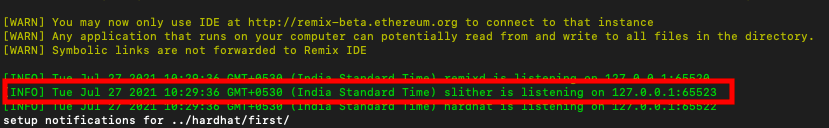
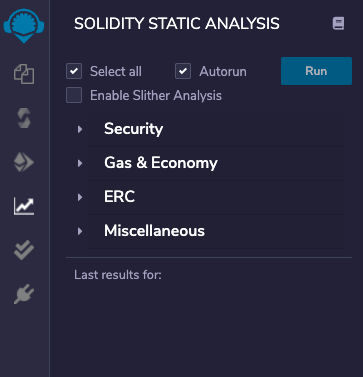
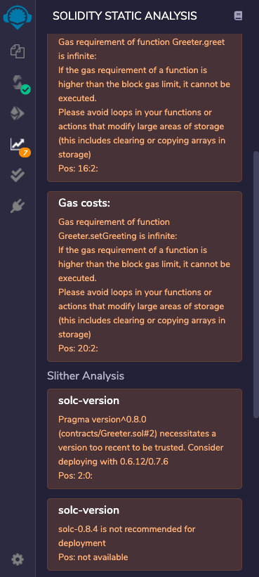
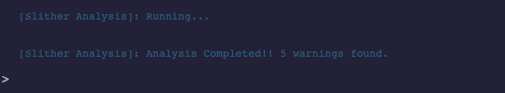
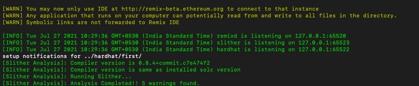
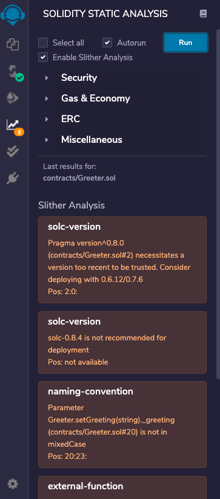
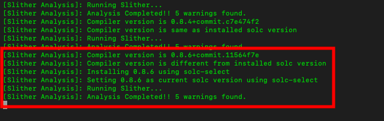
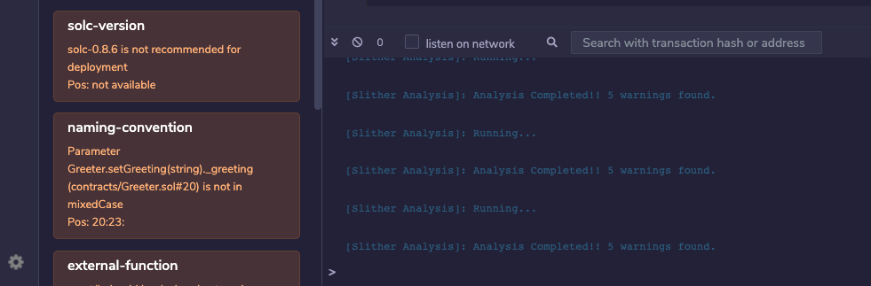

Slither Integration
============

_(Supported since Remix IDE v0.15.0 and Remixd v0.5.0)_

Remixd and Slither
------------------

**Note:** If you have not used `remixd` before, read more about it [here](./remixd.html)

Since Remixd `v0.5.0`, when `remixd` is running locally on your device, an additional websocket plugin will be listening on port `65523` which will be dedicated for [Slither](https://github.com/crytic/slither) integration.

> _Slither is a Solidity static analysis framework written in Python 3. It runs a suite of vulnerability detectors, prints visual information about contract details, and provides an API to easily write custom analyses._

The remixd Slither listener is a websocket plugin similar to remixd and is used to perform Slither analysis with Remix IDE. 

It doesn't need any separate installation as it is shipped with [remixd NPM](https://www.npmjs.com/package/@remix-project/remixd) module.

Enable Slither Analysis
------------------

### Prerequisites

To use Slither analysis with Remix IDE efficiently, following tools should be installed locally on the system:

1. **Slither:** [https://github.com/crytic/slither#how-to-install](https://github.com/crytic/slither#how-to-install)
2. **Solc:** [https://docs.soliditylang.org/en/latest/installing-solidity.html](https://docs.soliditylang.org/en/latest/installing-solidity.html)
3. **Solc-select:** [https://github.com/crytic/solc-select#quickstart](https://github.com/crytic/solc-select#quickstart)

### How to use

If a project is shared through remixd and `localhost` workspace is loaded in Remix IDE, there will be an extra checkbox shown in `Solidity Static Analysis` plugin with the label `Enable Slither Analysis`.

There is an info icon on the right side of the label which redirects to a specific section of Remix official documentation that explains how to use Slither Analysis and prerequisites for it.

One can check the `Enable Slither Analysis` box to run the analysis using Slither along with the Remix's analysis library. 

Generated report of Slither analysis will be stored locally on project root with a file name prefixed with `remix-slitherReport_`, for example: `remix-slitherReport_1627362090.json`. 

Slither Analysis report will also be displayed on the Remix IDE side after the Remix analysis report for better user readability.

The result of the analysis will be shown in the Remix IDE terminal 

and also in the **remixd** console.

To only run Slither Analysis, deselect `Select all` checkbox and click on `Run`. Now it will show only the Slither Analysis report.

### More Details

Analysis for Slither is run using the version set in `Solidity Compiler` plugin on Remix IDE. Slither is a CLI tool and requires `solc` to run the analysis. Before running the analysis, Slither websocket plugin checks if current version of solc is same as the version set in Remix IDE.

If the compiler version set in Solidity Compiler is different from current version of solc installed locally, the Slither websocket plugin will update the `solc` to be the same as the required version `solc-select`.

For example, if current `solc` version on the system is 0.8.4 and on the Remix IDE 0.8.6 is set, `remixd` logs explain remote solc version selection

After successful analysis run:

