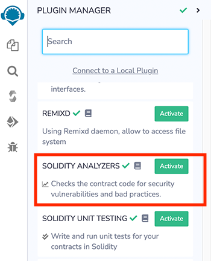
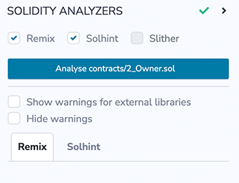
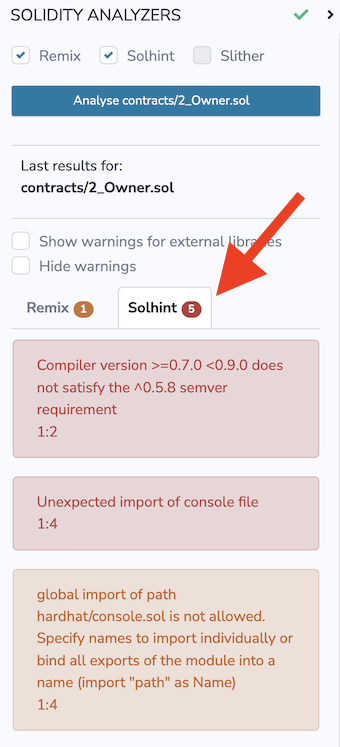
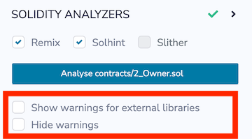

# Solidity Analyzers

Static code analysis is a process of debugging code by examining it without executing it.

The `Solidity Analyzers` plugin gangs three analysis tools together to perform static analysis on Solidity smart contracts. Each tool checks for security vulnerabilities and bad development practices, among other issues. It can be activated from Remix `Plugin Manager`.



`Solidity Analyzers` can also be loaded by clicking on the `Solidity` icon in the featured plugins section of Remix's home tab. This button loads the following plugins: Solidity Compiler, Solidity Unit Testing, and Static Analyzers.

`Solidity Analyzers` uses these tools:

- [Remix Analysis](#remix-analysis): a basic analysis tool
- [Solhint linter](https://github.com/protofire/solhint#rules): a Solidity linter for code and style guide validations
- [Slither Static Analysis](https://crytic.github.io/slither/slither.html): a comprehensive static analysis tool

```{note}
Slither can only be used when Remix is connected to the local computer's filesystem with {doc}`Remixd </remixd>`.
```

## How to use

**A contract must be compiled before analysis can be run.**

At the top of the panel, check the tools that you want to use.



### Errors & Warnings

By default, `Solidity Analyzers` will show both errors and warnings. The combined number of errors and warnings are shown in the badge in that tools tab.



If you check `Hide warnings`, warnings will be hidden and you'll exclusively see the errors.

**NOTE:** Remix Analysis does not flag error - it only shows warnings so if you check `Hide warnings`, nothing will show in the Remix Analysis tab.



#### Warnings from external libraries

By default, warnings from external libraries are not shown. If you check the box `Show warnings for external libraries`, the tools will also analyse the external libraries for warnings.

## Slither

To run [Slither](https://github.com/crytic/slither#slither-the-solidity-source-analyzer) with this plugin, you need to connect Remix IDE to your filesystem with [Remixd](remix.html). Once Remixd is running, Slither is automatically loaded.

## Solhint

The [Solhint](https://github.com/protofire/solhint#rules) linter can be run without connecting Remix to your filesystem.

## Remix Analysis

Remix Analysis has 4 categories: `Security`, `Gas & Economy`, `ERC` & `Miscellaneous`.

Here is the list of modules under each category along with the example code which **should be avoided or used very carefully while development**:

### Category: Security

- **Transaction origin: 'tx.origin' is used**

`tx.origin` is useful only in very exceptional cases. If you use it for authentication, you usually want to replace it by "msg.sender", because otherwise any contract you call can act on your behalf.

_Example:_

```Solidity
require(tx.origin == owner);
```

- **Check effects: Potential reentrancy bugs**

Potential Violation of Checks-Effects-Interaction pattern can lead to re-entrancy vulnerability.

_Example:_

```Solidity
// sending ether first
msg.sender.transfer(amount);

// updating state afterwards
balances[msg.sender] -= amount;
```

- **Inline assembly: Inline assembly used**

Use of inline assembly is advised only in rare cases.

_Example:_

```Solidity
assembly {
            // retrieve the size of the code, this needs assembly
            let size := extcodesize(_addr)
}
```

- **Block timestamp: Semantics may be unclear**

`now` does not mean current time. `now` is an alias for `block.timestamp`. `block.timestamp` can be influenced by miners to a certain degree, be careful.

_Example:_

```Solidity
// using now for date comparison
if(startDate > now)
    isStarted = true;

// using block.timestamp
uint c = block.timestamp;
```

- **Low level calls: Semantics may be unclear**

Use of low level `call`, `callcode` or `delegatecall` should be avoided whenever possible. `send` does not throw an exception when not successful, make sure you deal with the failure case accordingly. Use `transfer` whenever failure of the ether transfer should rollback the whole transaction.

_Example:_

```Solidity
x.call('something');
x.send(1 wei);
```

- **Blockhash usage: Semantics maybe unclear**

`blockhash` is used to access the last 256 block hashes. A miner computes the block hash by "summing up" the information in the current block mined. By summing up the information in a clever way a miner can try to influence the outcome of a transaction in the current block.

_Example:_

```Solidity
bytes32 b = blockhash(100);
```

- **Selfdestruct: Beware of caller contracts**

`selfdestruct` can block calling contracts unexpectedly. Be especially careful if this contract is planned to be used by other contracts (i.e. library contracts, interactions). Selfdestruction of the callee contract can leave callers in an inoperable state.

_Example:_

```Solidity
selfdestruct(address(0x123abc..));
```

### Category: Gas & Economy

- **Gas costs: Too high gas requirement of functions**

If the gas requirement of a function is higher than the block gas limit, it cannot be executed. Please avoid loops in your functions or actions that modify large areas of storage

_Example:_

```Solidity
for (uint8 proposal = 0; proposal < proposals.length; proposal++) {
    if (proposals[proposal].voteCount > winningVoteCount) {
        winningVoteCount = proposals[proposal].voteCount;
        winningProposal = proposal;
    }
}
```

- **This on local calls: Invocation of local functions via 'this'**

Never use `this` to call functions in the same contract, it only consumes more gas than normal local calls.

_Example:_

```Solidity
contract test {

    function callb() public {
        address x;
        this.b(x);
    }

    function b(address a) public returns (bool) {}
}
```

- **Delete on dynamic Array: Use require/assert appropriately**

The `delete` operation when applied to a dynamically sized array in Solidity generates code to delete each of the elements contained. If the array is large, this operation can surpass the block gas limit and raise an OOG exception. Also nested dynamically sized objects can produce the same results.

_Example:_

```Solidity
contract arr {
    uint[] users;
    function resetState() public{
        delete users;
    }
}
```

- **For loop over dynamic array: Iterations depend on dynamic array's size**

Loops that do not have a fixed number of iterations, for example, loops that depend on storage values, have to be used carefully: Due to the block gas limit, transactions can only consume a certain amount of gas. The number of iterations in a loop can grow beyond the block gas limit which can stall the complete contract at a certain point. Additionally, using unbounded loops can incur in a lot of avoidable gas costs. Carefully test how many items at maximum you can pass to such functions to make it successful.

_Example:_

```Solidity
contract forLoopArr {
    uint[] array;

    function shiftArrItem(uint index) public returns(uint[] memory) {
        for (uint i = index; i < array.length; i++) {
            array[i] = array[i+1];
        }
        return array;
    }
}
```

- **Ether transfer in loop: Transferring Ether in a for/while/do-while loop**

Ether payout should not be done in a loop. Due to the block gas limit, transactions can only consume a certain amount of gas. The number of iterations in a loop can grow beyond the block gas limit which can cause the complete contract to be stalled at a certain point. If required, make sure that number of iterations are low and you trust each address involved.

_Example:_

```Solidity
contract etherTransferInLoop {
    address payable owner;

    function transferInForLoop(uint index) public  {
        for (uint i = index; i < 100; i++) {
            owner.transfer(i);
        }
    }

    function transferInWhileLoop(uint index) public  {
        uint i = index;
        while (i < 100) {
            owner.transfer(i);
            i++;
        }
    }
}
```

### Category: ERC

- **ERC20: 'decimals' should be 'uint8'**

ERC20 Contracts `decimals` function should have `uint8` as return type.

_Example:_

```Solidity
contract EIP20 {

    uint public decimals = 12;
}
```

### Category: Miscellaneous

- **Constant/View/Pure functions: Potentially constant/view/pure functions**

It warns for the methods which potentially should be constant/view/pure but are not.

_Example:_

```Solidity
function b(address a) public returns (bool) {
        return true;
}
```

- **Similar variable names: Variable names are too similar**

It warns on the usage of similar variable names.

_Example:_

```Solidity
// Variables have very similar names voter and voters.
function giveRightToVote(address voter) public {
    require(voters[voter].weight == 0);
    voters[voter].weight = 1;
}
```

- **No return: Function with 'returns' not returning**

It warns for the methods which define a return type but never explicitly return a value.

_Example:_

```Solidity
function noreturn(string memory _dna) public returns (bool) {
       dna = _dna;
   }
```

- **Guard conditions: Use 'require' and 'assert' appropriately**

Use `assert(x)` if you never ever want x to be false, not in any circumstance (apart from a bug in your code). Use `require(x)` if x can be false, due to e.g. invalid input or a failing external component.

_Example:_

```Solidity
assert(a.balance == 0);
```

- **Result not used: The result of an operation not used**

A binary operation yields a value that is not used in the following. This is often caused by confusing assignment (=) and comparison (==).

_Example:_

```Solidity
c == 5;
or
a + b;
```

- **String Length: Bytes length != String length**

Bytes and string length are not the same since strings are assumed to be UTF-8 encoded (according to the ABI definition) therefore one character is not necessarily encoded in one byte of data.

_Example:_

```Solidity
function length(string memory a) public pure returns(uint) {
    bytes memory x = bytes(a);

    return x.length;
}
```

- **Delete from dynamic array: 'delete' on an array leaves a gap**

Using `delete` on an array leaves a gap. The length of the array remains the same. If you want to remove the empty position you need to shift items manually and update the length property.

_Example:_

```Solidity
contract arr {
    uint[] array = [1,2,3];

    function removeAtIndex() public returns (uint[] memory) {
        delete array[1];
        return array;
    }
}
```

- **Data Truncated: Division on int/uint values truncates the result**

Division of integer values yields an integer value again. That means e.g. 10 / 100 = 0 instead of 0.1 since the result is an integer again. This does not hold for division of (only) literal values since those yield rational constants.

_Example:_

```Solidity
function contribute() payable public {
    uint fee = msg.value * uint256(feePercentage / 100);
    fee = msg.value * (p2 / 100);
}
```

## Remix-analyzer

`remix-analyzer` is the library which works underneath the Remix Analysis tool.

`remix-analyzer` is an [NPM package](https://www.npmjs.com/package/@remix-project/remix-analyzer). It can be used as a library in a solution supporting node.js. Find more information about this type of usage in the [remix-analyzer repository](https://github.com/ethereum/remix-project/tree/master/libs/remix-analyzer#how-to-use)
