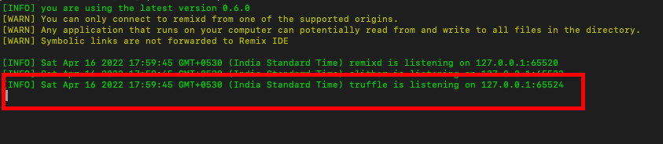
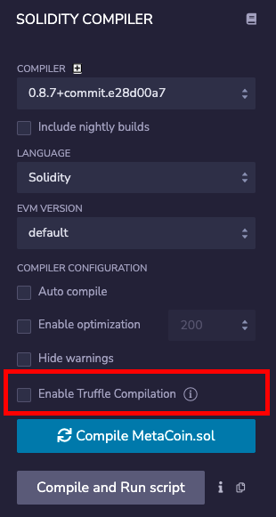
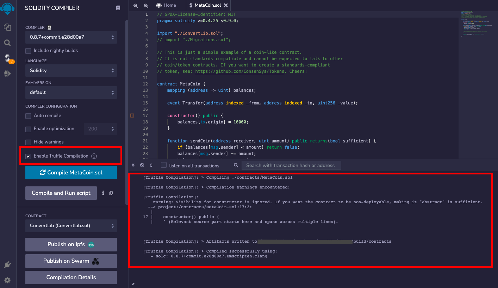
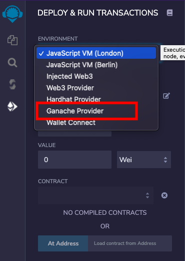
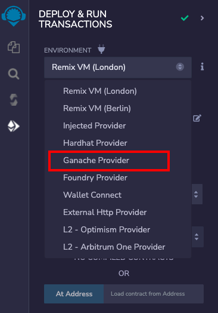

# Truffle

_(Supported since Remix IDE v0.23.0 and Remixd v0.6.0)_

## Remixd and Truffle

**Note:** If you have not used `remixd` before, read more about it {doc}`here </remixd>`

If `remixd` is running locally on your device and shared folder is a **Truffle project**, an additional websocket plugin will be listening on port `65524`. According to its documentation,

> _Truffle projects are projects with a truffle-config.js file._

Remixd looks for the `truffle-config.js` file in shared folder. If found, the Truffle websocket listener will run.

The Truffle websocket listener is a websocket plugin similar to `remixd` and is used to perform Truffle specific actions with Remix IDE.

It doesn't need any separate installation as it is shipped with [remixd NPM](https://www.npmjs.com/package/@remix-project/remixd) module.

## Enable Truffle Compilation

### Prerequisites

To use Truffle compilation with Remix IDE efficiently:

1. **Truffle** should be installed locally on the system [https://archive.trufflesuite.com/docs/truffle/getting-started/installation/](https://archive.trufflesuite.com/docs/truffle/getting-started/installation/)
2. Shared folder should be a Truffle project containing `truffle-config.js`
3. `Remixd` Truffle websocket listener should be running at `65524`

### How to use

If a truffle project is shared through remixd and `localhost` workspace is loaded in Remix IDE, there will be an extra checkbox shown in `Solidity Compiler` plugin with the label `Enable Truffle Compilation`.

There is an info icon alongside the label which redirects to a specific section of Remix official documentation that explains how to use Truffle compilation.

One can check the `Enable Truffle Compilation` box to run the compilation for Truffle along with the Remix using the compiler configuration in `Solidity Compiler` plugin.

On clicking `Compile` button, a file named as `remix-compiler.config.js` will be created on the project root which will be storing compiler configuration set in Remix's `Solidity Compiler` plugin. It is passed to Truffle for compilation.

The result of the compilation will be shown in the Remix IDE terminal

and also in the **remixd** terminal.

## Ganache Provider

_In Truffle, contracts are deployed by connecting to a built-in personal blockchain, i.e. Ganache. Read more about it in [Truffle documentation](https://trufflesuite.com/docs/truffle/quickstart/#migrating-with-truffle-develop)_

**Ganache Provider** is a plugin on Remix IDE which enables users to deploy the contract to the Truffle's built-in Ganache blockchain. `Ganache Provider` can be chosen from the list of environments in `Deploy & Run Transactions` plugin.

As soon as you select `Ganache Provider`, a modal is opened asking for the `Ganache JSON-RPC Endpoint`.

If Ganache node is running with default options, the default endpoint value in modal will not need any change. In case, Ganache node host and port are different, JSON-RPC endpoint should be updated in the modal text box.

Once the correct endpoint is filled in the modal, just click on `OK` and the accounts from the Ganache node will be loaded in the `ACCOUNT` section. Network id will also be shown.

Now, one can start deploying the contract from Remix IDE to the local Ganache node as usual.
