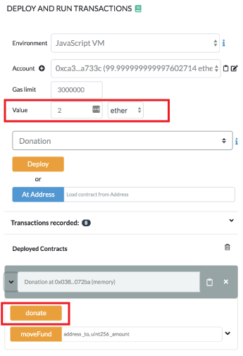
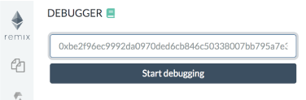

Debugging Transactions
======================

(also see this page's companion: [the Debugger Tour](debugger.html))

There are two ways to start a debugging session, each one corresponds to a different use case.
* Use Case 1: for debugging a transaction made in Remix - click the **Debug button** in the transaction log in Remix's Terminal.

* Use Case 2: for debugging a transaction where you have a **txn hash** from **verified contract** or where you have the txn hash and the compiled source code with the same compilation settings as the deployed contract.

### Initiate Debugging from the transaction log in the Terminal
Let's start with a basic contract ( or replace the contract below with your own ) 

``` 
pragma solidity >=0.5.1 <0.6.0;
contract Donation {
    address owner;
    event fundMoved(address _to, uint _amount);
    modifier onlyowner { if (msg.sender == owner) _; }
    address[] _giver;
    uint[] _values;

    constructor() public {
        owner = msg.sender;
    }

    function donate() public payable {
        addGiver(msg.value);
    }

    function moveFund(address payable _to, uint _amount) onlyowner  public {
        uint balance = address(this).balance;
        uint amount = _amount;
        if (amount <= balance) {
            if (_to.send(balance)) {
                emit fundMoved(_to, amount);    
            } else {
               revert();
            }
        } else {
            revert();
        }
    }

    function addGiver(uint _amount) internal {
        _giver.push(msg.sender);
        _values.push(_amount);
    }
}
```

- Make a new file in Remix and copy the code above into it.
- Compile the code.
- Go to the Run & Deploy module.

For the purpose of this tutorial, we will run the `Remix VM`.

- Deploy the contract:

Click the `Deploy` button


You'll see the deployed instance (AKA the udapp).

Open it up (by clicking the caret).


We are going to call the `Donate` function and will send 2 Ethers.  

To do this: in the value input box put in **2** and **select Ether** as the unit (DO NOT LEAVE THE DEFAULT unit as **gwei** or the change will be hard to detect).



Then click the `Donate` button.

This will send the Ether to the function.

Because we are using the `Remix VM`, everything happens almost instantly.  (If we had been using Injected Web 3, then we would have needed to approve the transaction, pay for gas and wait for the transaction to get mined.)

Remix displays information related to each transaction result in the terminal.

Check in the **terminal** where the transaction you just made is logged. 

Click the **debug button**.


But before we get to the actual debugging tool, the next section shows how to start a debugging session directly from the Debugger.

### Initiate Debugging from the Debugger

Click the bug icon in the icon panel to get to the debugger in the side panel.  

If you don't see the bug icon, go to the plugin manager and activate the debugger.

You can start a debug session by providing a `transaction hash`.

To find a transaction hash: 
1. Go to a transaction in the terminal. 
2. Click a line with a transaction - to expand the log.
3. The transaction hash is there - copy it.


Then click in the debugger paste the hash and click on the `Start debugging` button.



Using the debugger
------------------


The debugger allows one to see detailed informations about the
transaction's execution. It uses the editor to display the
location in the source code where the current execution is.

The navigation part contains a slider and buttons that can be used to
step through the transaction execution.


### Explanation of Debugger button capabilities

1. Step Over Back
    Returns to the previous step, but ignores/steps over function calls: the debugger WILL NOT enter a function
2. Step Back
    Returns to the previous step. Does not ignore function calls: the debugger WILL enter any function along the way
3. Step Into
    Forwards to the next step. Does not ignore function calls: the debugger WILL enter any function along the way
4. Step Over Forward
    Forwards to the next step, but ignores/steps over function calls: the debugger WILL NOT enter a function
5. Jump to the Previous Breakpoint
    Sends the debugger to the last visited breakpoint. Note that breakpoints may be set by clicking the line number in source code
6. Jump Out
    Sends the debugger to the function's end
7. Jump to the Next Breakpoint
    Sends the debugger to the next breakpoint


## 11 panels give detailed information about the execution:

### Instructions

The Instructions panel displays the bytecode of the current executing
contract- with the current step highlighted.

Important note: When this panel is hidden, the slider will have a
coarser granularity and only stop at *expression boundaries*, even if they
are compiled into multiple EVM instructions. When the panel is
displayed, it will be possible to step over every instruction, even
those that refers to the same expression.

### Solidity Locals

The Solidity Locals panel displays local variables associated with the
current context.

### Solidity State

The Solidity State panel displays state variables of the current
executing contract.

### Low level panels

These panels display low level informations about the execution:

> -   Stack
> -   Storages Changes
> -   Memory
> -   Call Data
> -   Call Stack
> -   Return Value (only if the current step is a RETURN opcode)
> -   Full Storages Changes (only at the end of the execution & it displays all the storage changes)

### Reverted Transaction

A transaction can be `reverted` (because of an *out of gas exception*, a Solidity `revert` statement or a low level exception).

It is important to be aware of the exception and to locate where the exception is in the source code.

Remix will warn you when the execution throws an exception. 
The `warning` button will jump to the last opcode before the exception happened.

### Breakpoints

The two last buttons from the navigation area are used to jump either
back to the previous breakpoint or forward to the next breakpoint.

Breakpoints can be added and removed by clicking on the line number in the **Editor**.

When using a debug session with breakpoints, the execution will jump to the first
encountered breakpoint.

**Important note:** If you add a breakpoint to a line that declares a
variable, it might be triggered twice: Once for initializing the
variable to zero and a second time for assigning the actual value. 

Here's an example of this issue.  If you are debugging the following contract:

``` 
pragma solidity >=0.5.1 <0.6.0;

contract ctr {
    function hid() public {
        uint p = 45;
        uint m;
        m = 89;
        uint l = 34;
    }
}
```

And breakpoints are set for the lines

`uint p = 45;`

`m = 89;`

`uint l = 34;`

then clicking on the `Jump to the next breakpoint` button will stop at the following
lines in the given order:

> `uint p = 45;` (declaration of p)
>
> `uint l = 34;` (declaration of l)
>
> `uint p = 45;` (45 assigned to p)
>
> `m = 89;` (89 assigned to m)
>
> `uint l = 34;` (34 assigned to l)
