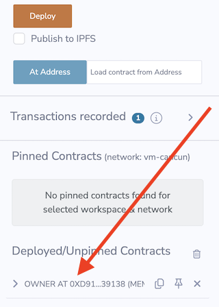
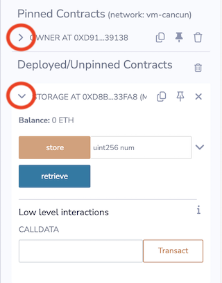
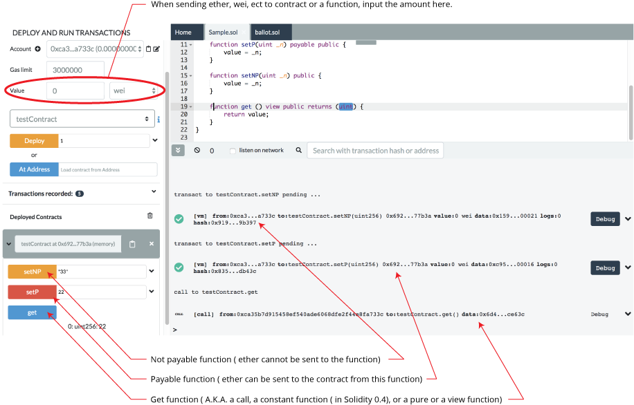
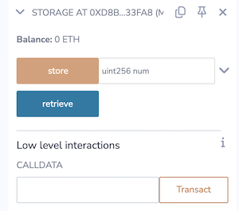
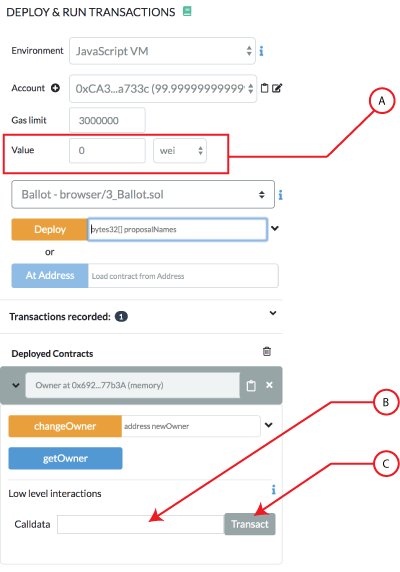

Deploy & Run (part 2)
=====================

## Interacting with deployed contracts

After a contract is deployed or after it is accessed with AtAddress, the deployed instance will appear in the **Deploy/Unpinned Contracts** section at the bottom of the Deploy & Run panel.



The deployed contract's address is visible as are a few other icons - one of which is the **pin** icon.  

## Pinned contracts
When a contract is pinned, it will jump up to the **Pinned Contracts** section and Remix will save the contract's address and the ABI (in the .deploys folder of the current Workspace).  When Remix is refreshed, the pinned contracts will be loaded into the Pinned Contracts section.  

#### Pinned contracts are chain & Workspace specific
Because a pinned contract's address and ABI are stored in a File Explorer Workspace, the same Workspace must be active to see its pinned contracts.  Similarly, only the pinned contracts of the currently selected chain will show.

## Functions 
To see a contract's functions, click the caret on the left side of the panel.



The functions' buttons can have different colors.

-   Blue buttons are for `view` or `pure` functions. Clicking a blue button does not create a new transaction - so there will be **no gas fees**.

-   Orange buttons are for `non-payable` functions.  Non-payable functions change the state of the contract BUT **do not accept value** (typically ETH) being sent with the transaction. Clicking an orange button will create a transaction and will cost gas.

-   Red buttons are for `payable` functions. Clicking a red button will create a new transaction and this transaction can accept a **value** (typically ETH).  The amount of value is set in in the **Value** field which is under the Gas Limit field.




See more information about [Solidity
modifiers](https://docs.soliditylang.org/en/latest/cheatsheet.html#modifiers) - in the Solidity docs.

## Inputting parameters
A function has two views - the collapsed and the expanded view, which is visible after clicking the caret on the right side of the panel.  

+ The input box shows the expected type of each parameter.
+ Numbers and addresses do not need to be wrapped in double quotes.  
+ Strings do not need to be wrapped.


### Inputting parameters in the collapsed view

In the collapsed view:

+ Parameters are separated by commas.

In the example above the "delegate" function has 3 parameters.

### Inputting parameters in the expanded view
Clicking the 'down' caret brings you to the expanded view - where parameters are input one at a time. 


## Low level interactions

Low level interactions are used to send funds or calldata or funds & calldata to a contract through the **receive()** or **fallback()** function.  Typically, you should only need to implement the fallback function if you are following an upgrade or proxy pattern.

The low level interactions section is below the functions in each deployed contract.



Please note the following:

- If you are executing a plain Ether transfer to a contract, you need to have the receive() function in your contract.  If your contract has been deployed and you want to send it funds, you would input the amount of Ether or Wei etc. (see **A** in graphic below), and then input **NOTHING** in the calldata field of **Low level interactions** (see **B** in graphic) and click the Transact button (see **C** in graphic below).



- If you are sending calldata to your contract with Ether, then you need to use the fallback() function and have it with the state mutability of **payable**.  

- If you are not sending ether to the contract but **are** sending call data then you need to use the fallback() function.

- If you break the rules when using the **Low level interactions** you will be slapped with a warning.

Please see the [solidity docs](https://solidity.readthedocs.io/en/latest/contracts.html#receive-ether-function) for more specifics about using the **fallback** and **receive** functions. 

## Inputting a tuple or struct to a function
To pass a tuple, you need to put in an array [].

Similarly, to pass in a struct as a parameter of a function, it needs to be put in as an array [].  

**NOTE:** the file's pragma must be set to: `pragma experimental ABIEncoderV2;`

### Example of passing nested struct to a function
Consider a nested struct defined like this:
```
struct Garden {
    uint slugCount;  
    uint wormCount;
    Flower[] theFlowers;
}
struct Flower {
    uint flowerNum;
    string color;
}
```
If a function has the signature `fertilizer(Garden memory gardenPlot)` then the correct syntax is:
```
[1,2,[[3,"Petunia"]]]
```

To continue on this example, here's a sample contract:

```
pragma solidity >=0.4.22 <0.7.0;
pragma experimental ABIEncoderV2;

contract Sunshine {
    struct Garden {
      uint slugCount;  
      uint wormCount;
      Flower[] theFlowers;
    }
    struct Flower {
        uint flowerNum;
        string color;
    }
      
    function fertilizer(Garden memory gardenPlot) public {
        uint a = gardenPlot.slugCount;
        uint b = gardenPlot.wormCount;
        Flower[] memory cFlowers = gardenPlot.theFlowers;
        uint d = gardenPlot.theFlowers[0].flowerNum;
        string memory e = gardenPlot.theFlowers[0].color;
    }
}
```

After compiling, deploying the contract and opening up the deployed instance, we can then add the following input parameters to the function named **fertilizer** :

```
[1,2,[[3,"Black-eyed Susan"],[4,"Pansy"]]]
```

The function **fertilizer** accepts a single parameter of the type **Garden**. The type **Garden** is a **struct**. Structs are wrapped in **square brackets**.  Inside **Garden** is an array that is an array of structs named **theFlowers**. It gets a set of brackets for the array and another set for the struct. Thus the double square brackets.
