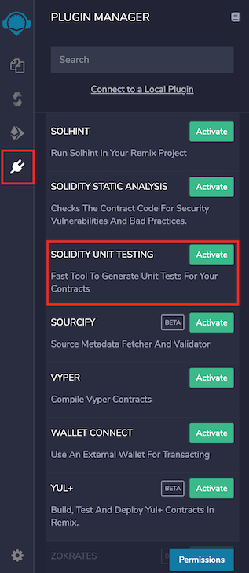
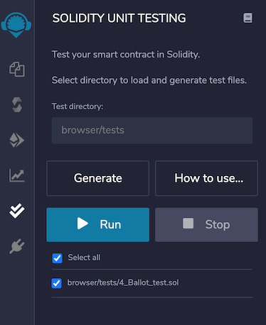
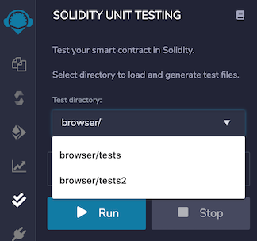
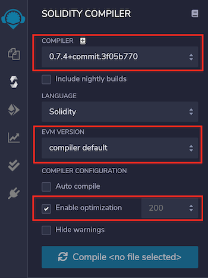

Unit Testing Plugin
============

Click the
 (double check)
 icon from icon bar to move to the `Solidity Unit Testing` plugin. 
 
 If you haven't used this plugin before and are not seeing the `double check` icon, you have to activate it from Remix plugin manager.
 
Go to the plugin manager by clicking the  (plug) icon and activate `Solidity Unit Testing` plugin.



Now the `double check` icon will appear on the left side icon bar. Clicking on the icon will load the plugin in the side panel.

<i>Alternatively, select `Solidity` environment from Remix IDE `Home` tab. This will activate `Solidity Unit Testing` plugin along with `Solidity Compiler`, `Deploy & Run Transactions` & `Solidity Static Analysis` plugins.</i>

After successful loading, plugin looks like this:



Test directory
----------
Plugin asks you to provide a directory which will be your unit testing workspace (not to be confused with a Workspace in the File Explorer). To select directory, as soon as you add `/` to the path, it shows the possible options. [Rob Edit]



Once selected, this directory will be used to load test files and to store newly generated test files.

Default test directory is `browser/tests`.

Generate
----------
Select the Solidity file which you want to test and click on the `Generate` button. In the `test` directory, a test file will be created for your selected file. 

If no file is selected, a generic test file named, `newFile_test.sol` will be created.

This file contains information about developing tests for a contract.

Below is an example of a generic test file:

```
pragma solidity >=0.4.22 <0.8.0;
import "remix_tests.sol"; // this import is automatically injected by Remix.
import "remix_accounts.sol";
// Import here the file to test.

// File name has to end with '_test.sol', this file can contain more than one testSuite contracts
contract testSuite {

    /// 'beforeAll' runs before all other tests
    /// More special functions are: 'beforeEach', 'beforeAll', 'afterEach' & 'afterAll'
    function beforeAll() public {
        // Here should instantiate tested contract
        Assert.equal(uint(1), uint(1), "1 should be equal to 1");
    }

    function checkSuccess() public {
        // Use 'Assert' to test the contract, 
        // See documentation: https://remix-ide.readthedocs.io/en/latest/assert_library.html
        Assert.equal(uint(2), uint(2), "2 should be equal to 2");
        Assert.notEqual(uint(2), uint(3), "2 should not be equal to 3");
    }

    function checkSuccess2() public pure returns (bool) {
        // Use the return value (true or false) to test the contract
        return true;
    }
    
    function checkFailure() public {
        Assert.equal(uint(1), uint(2), "1 is not equal to 2");
    }

    /// Custom Transaction Context
    /// See more: https://remix-ide.readthedocs.io/en/latest/unittesting.html#customization
    /// #sender: account-1
    /// #value: 100
    function checkSenderAndValue() public payable {
        // account index varies 0-9, value is in wei
        Assert.equal(msg.sender, TestsAccounts.getAccount(1), "Invalid sender");
        Assert.equal(msg.value, 100, "Invalid value");
    }
}
```

Write Tests
-----------
Write sufficient unit tests to ensure that your contract works as expected under different scenarios. 

Remix injects a built-in `assert` library for testing. You can visit the library documentation [here](./assert_library).

Additionally, Remix allows the usage of special functions in the test file to make testing more structural. They are:

* `beforeEach()` - Runs before each test
* `beforeAll()` - Runs before all tests
* `afterEach()` - Runs after each test
* `afterAll()` - Runs after all tests

To get started, see [this simple example](./unittesting_examples.html#simple-example).

Run
-----
Once you are done with writing tests, select the file(s) and click on `Run` to execute the tests. The execution will run in a separate environment. After completing the execution of one file, a test summary will be shown:


For failed tests, there will be more assertion details to analyze the issue. Clicking on failed test will highlight the relevant line of code in the editor.

Stop
-----
If you have selected multiple files to run the tests and want to stop the execution, click on `Stop` button. It will stop execution after running the tests for current file.

Customization
------------------
Remix facilitates users with various types of customizations to test a contract properly.

**1. Custom Compiler Context**

`Solidity Unit Testing` refers to the `Solidity Compiler` plugin for compiler configurations. Configure `Compiler`, `EVM Version`, `Enable Optimization` & `runs` in the `Solidity Compiler` plugin and this will be used in the `Solidity Unit Testing` plugin for contract compilation before running unit tests.




**2. Custom Transaction Context**

For interacting with a contract's method, the prime parameters of a transaction are `from` address, `value` & `gas`. Typically, a method's behaviour is tested with different values of these parameters.

One can input custom values for `msg.sender` & `msg.value` of transaction using NatSpec comments, like:

```
/// #sender: account-0
/// #value: 10
function checkSenderIs0AndValueis10 () public payable {
    Assert.equal(msg.sender, TestsAccounts.getAccount(0), "wrong sender in checkSenderIs0AndValueis10");
    Assert.equal(msg.value, 10, "wrong value in checkSenderIs0AndValueis10");
}
```
<b>Instructions to use:</b>

1. Parameters must be defined in the method's NatSpec
2. Each parameter key should be prefixed with a hash (**#**) and end with a colon following a space (**:&nbsp;**) like `#sender: ` & `#value: `
3. For now, customization is only available for parameters `sender` & `value` 
4. Sender is the `from` address of a transaction which is accessed using `msg.sender` inside a contract method. It should be defined in a fixed format as '**account-**<account_index>'
5. `<account_index>` varies from `0-2` before remix-ide release v0.10.0 and `0-9` afterwards
6. `remix_accounts.sol` must be imported in your test file to use custom `sender`
7. Value is `value` sent along with a transaction in `wei` which is accessed using `msg.value` inside a contract method. It should be a number.

Regarding `gas`, Remix estimates the required gas for each transaction internally. Still if a contract deployment fails with `Out-of-Gas` error, it tries to redeploy it by doubling the gas. Deployment failing with double gas will show error: ```contract deployment failed after trying twice: The contract code couldn't be stored, please check your gas limit```

Various test examples can be seen in [examples](https://remix-ide.readthedocs.io/en/latest/unittesting_examples.html) section.


Points to remember
------------------

* A test contract cannot have a method with parameters. Having one such method will show error: `Method 'methodname' can not have parameters inside a test contract`
* Number of test accounts are `3` before remix-ide release v0.10.0 and `10` afterwards
* While a test file which imports `remix_accounts.sol` might not compile successfully with `Solidity Compiler` plugin, do not worry, this will have no bearing on its success with `Solidity Unit Testing` plugin.
