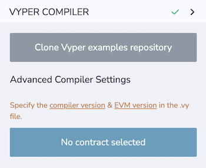
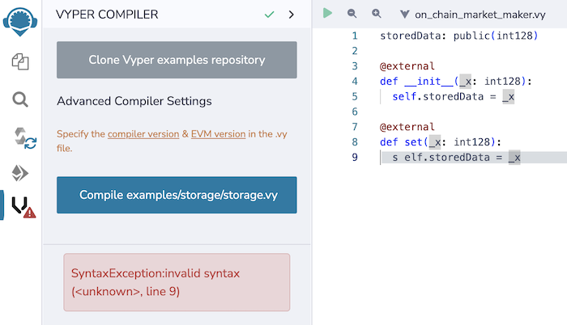

Vyper Compiler
==============

Vyper contracts can be compiled in Remix in the **Vyper compiler**.



The plugin can be activated going to:
1. the Plugin Manager and clicking on the Vyper compiler's activate button.
2. the File Explorer, then right clicking on a .vy file and selecting compile in the pop-up menu.
3. https://remix.ethereum.org/#activate=vyper

## Compiling a Vyper file
A Vyper file (with a .vy extension) needs to be the active file in the Editor.  To get some example files, click on the **Clone Vyper examples repo** button.  This will clone a repo and put it in a new Workspace.  Go to the File Explorer to see the files.

## Specifying Vyper, EVM Versions, and Optimize

To specify the version of Vyper, the EVM version, or Optimized, add a comment at the top of your .vy code like in the example below:

```
# @version ^0.3.0
```
As of 0.3.10, the recommended way to specify the version pragma is as follows:

```
#pragma version ^0.3.0
```

EVM version
```
# @pragma evm-version paris
```

Optimize
```
#pragma optimize codesize
```
For optimize, the choices options are `none`, `codesize`, or `optimize`.

For more info see the Vyperlang [docs](https://docs.vyperlang.org/en/stable/).

### Initiating compilation
There are 4 ways to compile:
1. Click the compile button in the plugin
2. Right click on a .vy file in the File Explorer and select `Compile for Vyper`.
3. Click on the play button at the top left of the Editor when a .vy file is the active tab.
4. CTRL + s when a .vy file is in the active tab of the Editor.

## Remote vs Local compiler
The default is to use the remote compiler.  To see the settings open up the Advanced Settings accordion box.

### Remote Compiler

The remote compilation is done using our remote containerized service that supports the official Vyper plugin for the Ape framework that ApeWorX maintains.

### Local Compiler

The local compilation can be done by connecting Remix Online IDE to your file system with Remixd and then running a docker container that runs the Ape framework. Click here for more info about this setup.

When the next version of Remix Desktop is ready, you’ll be able to run everything locally — both Remix, and the new Vyper compilers (still in Docker, of course).

## Compiler errors
When there are compiler errors in the Vyper plugin, a cards will appear at the bottom of the compiler.


Errors appear one at a time.  Fix one and the next, if there is one, will appear.

