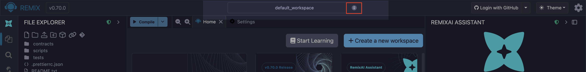
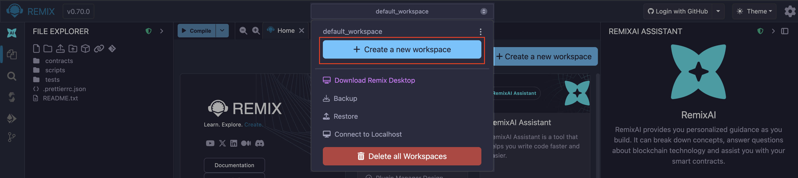
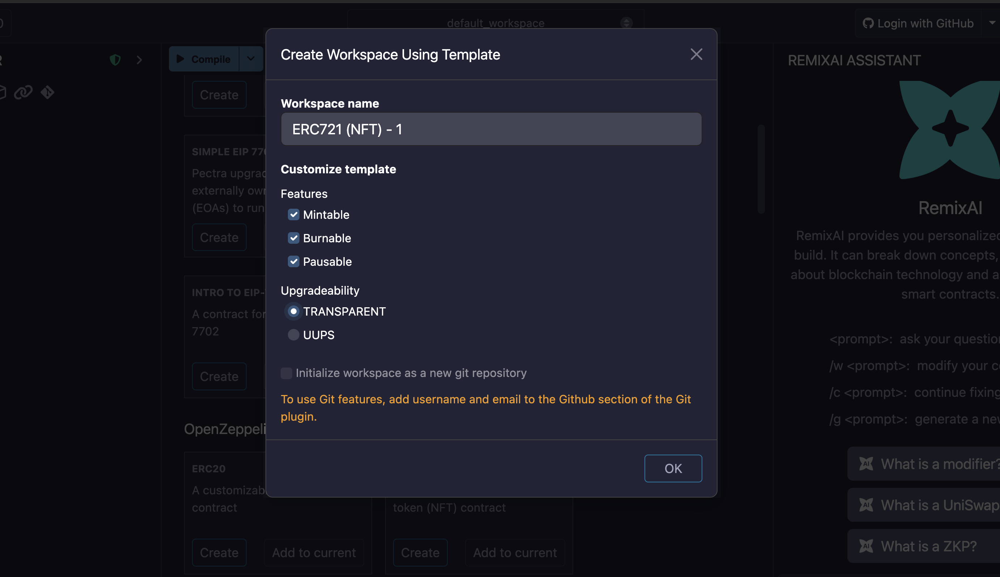
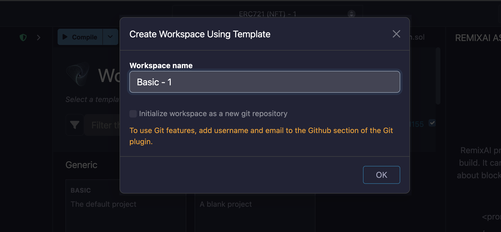
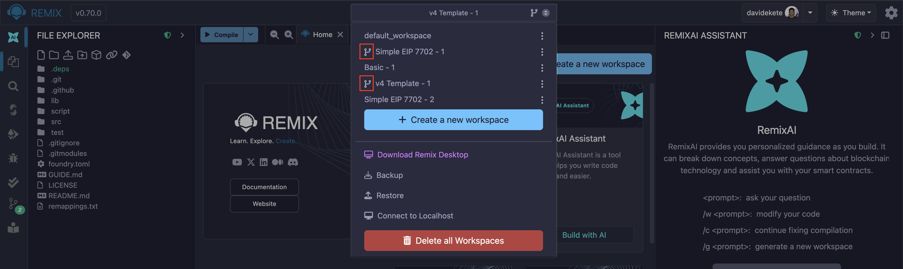

# Remix Workspaces

Workspaces in Remix are special folders that separate projects. Files in one workspace cannot import or access files in different workspace. You can select a workspace from the **Workspaces** dropdown on the Top Bar.

## Creating a new Workspace

You can create a new workspace by clicking the Workspaces dropdown and click the "**Create a new workspace**" button.

When you click the button, Remix takes you to the Workspace Templates page, where you can create a blank workspace or a workspace from a list of available templates. The available templates include but are not limited to the following:

- Remix Generic templates
- OpenZeppelin templates (ERC20, ERC721, ERC1155)
- Cookbook.dev templates
- Gnosis Safe MultiSig template
- Zero-Knowledge Proof (ZKP) templates (Circom, Noir, and Generic)
- Uniswap v4 templates
- Solidity CREATE2 templates
- Etherscan scripts for verifying contracts
- CI scripts for unit tests and security analysis

When you click the "**Create**" the button, a modal with customization options will popup. The options differ depending on the template you choose.

For example, when you create a Workspace with an OpenZeppelin template, you can add customize the features of the contract you create. The image below shows the options available for customizing an OpenZeppelin ERC721 contract template.

For other templates, the modal only contains a textbox for editing the Workspace name and an option to initialize it with Git.

### Initializing a Workspace with Git

To initialize a new Workspace for Git, check the box at the bottom of the Create Workspace modal.

Git initialized workspaces will have the Git icon next to them in the **Workspaces** selectbox.

