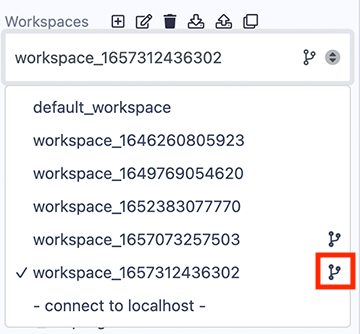

# Remix Workspaces

## Workspaces

Workspaces in Remix are special folders that separate projects. Files in one workspace cannot import or access files in different workspace. Choosing a workspace is done with the **Workspaces** select box.

#### New Workspace

Workspaces are created by clicking the + button or by going to the hamburger menu in the upper right side of the File Explorer.

When making a new workspace, Remix offers the following templates:

- Blank
- Remix Default
- OpenZeppelin ERC20
- OpenZeppelin ERC721
- OpenZeppelin ERC1155
- 0xProject ERC20
- Gnosis MultiSig

When choosing an OpenZeppelin template, additional functionality can be added.

#### Workspace operations

The **Workspace hamburger menu** is for operations that work on an entire workspace.

##### Clone

When clicking Clone, you’ll be asked for the url of a remote repo. A new workspace will be created that will contain the cloned repo. To manage the Git repo, go to the Dgit plugin.

##### Backup

Backup is for downloading all the Workspaces in a .zip file. The zip file will have a folder called **.workspaces** that will contain a folder of each Workspace. Depending on your OS, you may need to change the preferences on .workspaces folder to make it visible.

##### Restore

Restore is only for uploading the backup zip file.

##### Create GitHub Actions

The Workspace operations to create **Solidity Test Workflow**, **Mocha Chai Test Workflow**, and **Slither Workflow** are for creating GitHub actions. When clicked, a .yml file is created in the .workflows folder of the active Workspace.

### Workspaces initialized with Git

Git initialized workspaces will have the Git icon next to them in the **Workspaces** select box.

To initialize a new Workspace for GIT, check the box at the bottom of the Create Workspace modal.

## Working with Files

When a file is clicked on it will appear in the Editor.

Under the **Workspaces** select box are a number of icons that perform operations on files. More operations can be accessed by right-clicking on a file or folder ([see below](#right-click-on-a-file-or-folder)).

- **A.** Create a file  
- **B.** Create a folder  
- **C.** Publish all the file in this Workspace to a GIST 
- **D.** Upload a file into the current Workspace 
- **E.** Upload a folder into the current Workspace 
